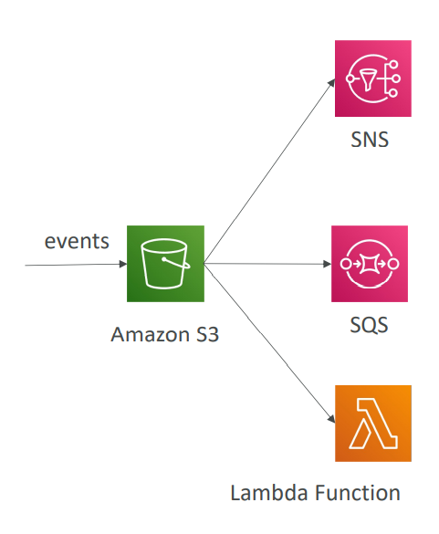
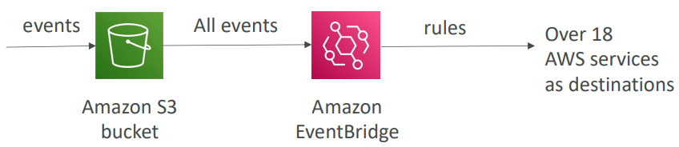
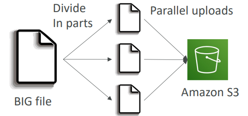
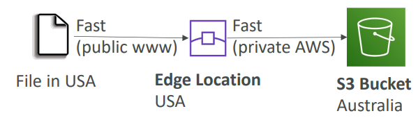
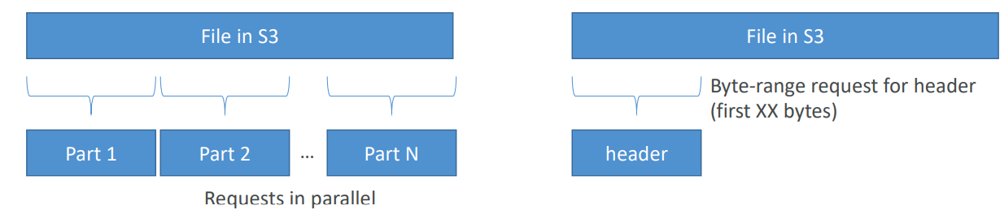
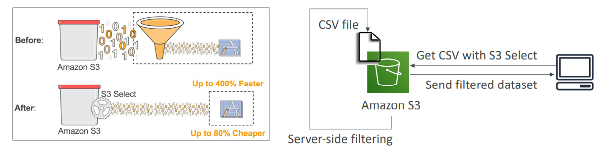
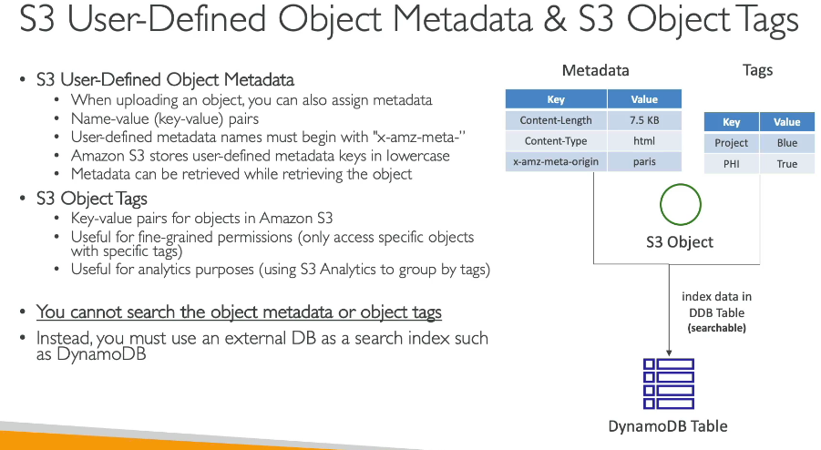

- [S3 Life cycle rules](#s3-life-cycle-rules)
- [S3 Event Notifications](#s3-event-notifications)
- [S3 – Baseline Performance](#s3--baseline-performance)
- [S3 Performance](#s3-performance)
  - [Multi-Part upload](#multi-part-upload)
  - [S3 Transfer Acceleration](#s3-transfer-acceleration)
  - [S3 Byte-Range Fetches](#s3-byte-range-fetches)
- [S3 Select \& Glacier Select](#s3-select--glacier-select)
- [S3 Metadata and Object tags](#s3-metadata-and-object-tags)

# S3 Life cycle rules 
**Amazon S3 – Moving between Storage Classes**
- You can transition objects between 
storage classes 
- For infrequently accessed object, 
move them to Standard IA
- For archive objects that you don’t 
need fast access to, move them to 
Glacier or Glacier Deep Archive
- Moving objects can be automated 
using a Lifecycle Rules

- Transition Actions – configure objects to transition to another storage class
  - Move objects to Standard IA class 60 days after creation
  - Move to Glacier for archiving after 6 months
- Expiration actions – configure objects to expire (delete) after some time
  - Access log files can be set to delete after a 365 days
  - Can be used to delete old versions of files (if versioning is enabled)
  - Can be used to delete incomplete Multi-Part uploads
- Rules can be created for a certain prefix (example: s3://mybucket/mp3/*)
- Rules can be created for certain objects Tags (example: Department: Finance)

**Scenario**
- A rule in your company states that you should be able to recover your 
deleted S3 objects immediately for 30 days, although this may happen 
rarely. After this time, and for up to 365 days, deleted objects should be 
recoverable within 48 hours.
  - Enable S3 Versioning in order to have object versions, so that “deleted 
  objects” are in fact hidden by a “delete marker” and can be recovered
  - Transition the “noncurrent versions” of the object to Standard IA
  - Transition afterwards the “noncurrent versions” to Glacier Deep Archive

**Storage Class Analysis**
- Help you decide when to transition objects to 
the right storage class
- Recommendations for Standard and Standard IA
- Does NOT work for One-Zone IA or Glacier
- Report is updated daily
- 24 to 48 hours to start seeing data analysis
- Good first step to put together Lifecycle Rules 
(or improve them)!

# S3 Event Notifications

- S3:ObjectCreated, S3:ObjectRemoved, 
S3:ObjectRestore, S3:Replication…
- Object name filtering possible (*.jpg)
- Use case: generate thumbnails of images 
uploaded to S3
- Can create as many “S3 events” as desired
- S3 event notifications typically deliver events 
in seconds but can sometimes take a minute 
or longer

**Event Notifications with Amazon EventBridge**

- Advanced filtering options with JSON rules (metadata, object size, name...)
- Multiple Destinations – ex Step Functions, Kinesis Streams / Firehose…
- EventBridge Capabilities – Archive, Replay Events, Reliable deliver

# S3 – Baseline Performance
- Amazon S3 automatically scales to high request rates, latency 100-200 ms
- Your application can achieve at least 3,500 PUT/COPY/POST/DELETE or 
5,500 GET/HEAD requests per second per prefix in a bucket. 
- There are no limits to the number of prefixes in a bucket. 
- **Example (object path => prefix):**
  - bucket/folder1/sub1/file => /folder1/sub1/
  - bucket/folder1/sub2/file => /folder1/sub2/
  - bucket/1/file => /1/
  - bucket/2/file => /2/
  - If you spread reads across all four prefixes evenly, you can achieve 22,000 
  requests per second for GET and HEAD

# S3 Performance
## Multi-Part upload

  - recommended for files > 100MB, must use for files > 5GB
  - Can help parallelize uploads (speed 
  up transfers)
## S3 Transfer Acceleration 

  - Increase transfer speed by transferring 
  file to an AWS edge location which will 
  forward the data to the S3 bucket in the 
  target region
  - Compatible with multi-part upload

## S3 Byte-Range Fetches

- Parallelize GETs by requesting specific byte ranges
- Better resilience in case of failures
- Can be used to speed up downloads
- Can be used to retrieve only partial 
data (for example the head of a file)

# S3 Select & Glacier Select

- Retrieve less data using SQL by performing server-side filtering
- Can filter by rows & columns (simple SQL statements)
- Less network transfer, less CPU cost client-side

# S3 Metadata and Object tags

