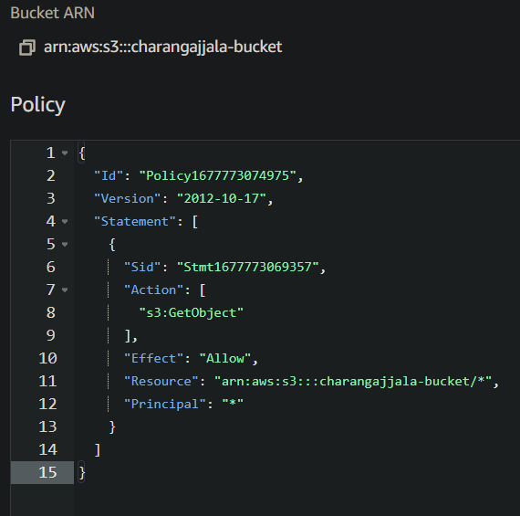

# Amazon S3 Basics 
- [Amazon S3 Basics](#amazon-s3-basics)
  - [S3 Overview](#s3-overview)
  - [Buckets](#buckets)
  - [Objects](#objects)
  - [Amazon S3 – Security](#amazon-s3--security)
  - [S3 Bucket Policies](#s3-bucket-policies)
  - [Static Website Hosting](#static-website-hosting)
  - [Versioning](#versioning)
  - [Replication (CRR \& SRR)](#replication-crr--srr)
  - [S3 Hands on](#s3-hands-on)

## S3 Overview
- Amazon S3 is one of the **main building blocks of AWS**
- It’s advertised as ”infinitely scaling” storage 
- Many websites use Amazon S3 as a backbone
- Many AWS services use Amazon S3 as an integration as well
- We’ll have a step-by-step approach to S3

**Amazon S3 Use cases** 
- Backup and storage,,, Disaster Recovery,,, Archive,,, Hybrid Cloud storage,,, Application hosting,,, Media hosting,,, Data lakes & big data analytics,,, Software delivery,,, Static website

## Buckets 
- Amazon S3 allows people to store objects (**files**) in “buckets” **(directories)**
- Buckets must have a **globally unique name** (across all regions all accounts)
- Buckets are defined at the **region level** 
- S3 looks like a global service but **buckets are created in a region**
- Naming convention
    - No uppercase, No underscore
    - 3-63 characters long
    - Not an IP
    - Must start with lowercase letter or number
    - Must NOT start with the prefix xn--
    - Must NOT end with the suffix -s3alias

## Objects
- Objects (files) have a Key
- The key is the FULL path:
    - s3://my-bucket/my_file.txt
    - s3://my-bucket/my_folder1/another_folder/my_file.txt
- The key is composed of `prefix` + **object name**
- s3://my-bucket/`my_folder1/another_folder/`**my_file.txt**
- There’s **no concept of “directories” within buckets**
(although the UI will trick you to think otherwise)
- Everthong in a bucket are just keys with very long names that contain slashes (“/”)
- Object values are the content of the body:
  - Max. Object Size is 5TB (5000GB)
  - If uploading more than 5GB, must use “multi-part upload”
- Metadata (list of text key / value pairs – system or user metadata)
- Tags (Unicode key / value pair – up to 10) – useful for security / lifecycle
- Version ID (if versioning is enabled)

## Amazon S3 – Security
- User-Based
  - IAM Policies – which API calls should be allowed for a specific user from IAM
  - Can use IAM role for allowing access to other aws resources
- Resource-Based
  - Bucket Policies – bucket wide rules from the S3 console - allows cross account
  - Object Access Control List (ACL) – finer grain (can be disabled)
  - Bucket Access Control List (ACL) – less common (can be disabled)
- Note: an IAM principal can access an S3 object if
- The user IAM permissions ALLOW it **OR** the resource policy ALLOWS it **AND** there’s no explicit DENY
- Encryption: encrypt objects in Amazon S3 using encryption keys

## S3 Bucket Policies

-  JSON based policies 
   -  Resources: buckets and objects 
   -  Effect: Allow / Deny 
   -  Actions: Set of API to Allow or Deny 
   -  Principal: The account or user to apply the 
   policy to
-  Use S3 bucket for policy to: 
   -  Grant public access to the bucket 
   -  Force objects to be encrypted at upload 
   -  Grant access to another account **(Cross Account)**

## Static Website Hosting
- S3 can host static websites and have them accessible on 
the Internet
- The website URL will be (depending on the region)
- http://bucket-name.s3-website-aws-region.amazonaws.com
OR http://bucket-name.s3-website.aws-region.amazonaws.com
- If you get a 403 Forbidden error, make sure the bucket 
policy allows public reads!

## Versioning

- You can version your files in Amazon S3
- It is enabled at the bucket level
- Same key overwrite will change the “version”: 1, 2, 3….
- It is best practice to version your buckets
  - Protect against unintended deletes (ability to restore a version)
  - Easy roll back to previous version 
- Notes:
  - Any file that is not versioned prior to enabling versioning will 
  have version “null”
  - Suspending versioning does not delete the previous versions
- If you delete a file with no version in buket with versioning enabled, the file will just be marked as deleted, but a versioned file will be permanently deleted.

## Replication (CRR & SRR)
- Must enable Versioning in source and destination buckets
- Cross-Region Replication (CRR)
- Same-Region Replication (SRR)
- Buckets can be in **different AWS accounts**
- Copying is asynchronous
- Must give proper IAM permissions to S3
- **Use cases**:
  - CRR – compliance, lower latency access, replication across accounts
  - SRR – log aggregation, live replication between production and test 
  accounts
- After you enable Replication, only new objects are replicated
- Optionally, you can replicate existing objects using S3 Batch Replication
  - Replicates existing objects and objects that failed replication
- For DELETE operations
  - Can replicate delete markers from source to target (optional setting)
  - Deletions with a version ID are not replicated (to avoid malicious deletes)
- There is no “chaining” of replication
  - If bucket 1 has replication into bucket 2, which has replication into bucket 3
  - Then objects created in bucket 1 are not replicated to bucket 3

## S3 Hands on 
- Create a bucket and use all default options
- 
- Add a file (image) in the bucket
- 
- See th properties, Object url is the public url for this object. right now we cant access through this url
- 
- Now edit the bucket and a bucket policy json to allow public permissions, then we can access from public url
- 
- Enable static website option and also upload index.html file in the bucket and open the provided url to see the html file served
- 
- 

