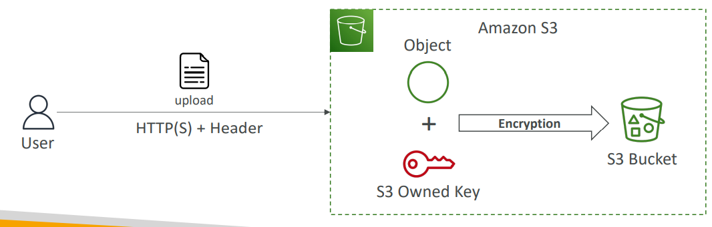
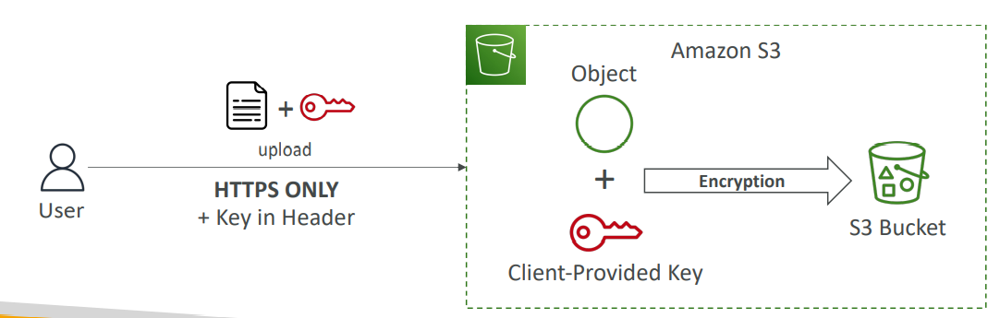
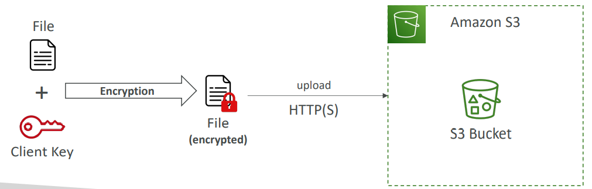

# Amazon S3 – Object Encryption
- You can encrypt objects in S3 buckets using one of 4 methods
- Server-Side Encryption (SSE)
  - Server-Side Encryption with Amazon S3-Managed Keys (SSE-S3) – Enabled by Default
    - Encrypts S3 objects using keys handled, managed, and owned by AWS
  - Server-Side Encryption with KMS Keys stored in AWS KMS (SSE-KMS)
    - Leverage AWS Key Management Service (AWS KMS) to manage encryption keys
  - Server-Side Encryption with Customer-Provided Keys (SSE-C)
    - When you want to manage your own encryption keys
- Client-Side Encryption 
- It’s important to understand which ones are for which situation for the exam

## SSE-S3

- Encryption using keys handled, managed, and owned by AWS 
- Object is encrypted server-side 
- Encryption type is AES-256 
- Must set header "x-amz-server-side-encryption": "AES256" 
- Enabled by default for new buckets & new objects

## SSE-KMS
- Encryption using keys handled and managed by AWS KMS (Key Management Service)
- KMS advantages: user control + audit key usage using CloudTrail
- Object is encrypted server side
- Must set header "x-amz-server-side-encryption": "aws:kms"

**KMS Limitations**
- If you use SSE-KMS, you may be impacted 
by the KMS limits 
- When you upload, it calls the 
GenerateDataKey KMS API
- When you download, it calls the Decrypt
KMS API
- Count towards the KMS quota per second 
(5500, 10000, 30000 req/s based on region)
- You can request a quota increase using the 
Service Quotas Console

## SSE-C

- Server-Side Encryption using keys fully managed by the customer outside of AWS
- Amazon S3 does NOT store the encryption key you provide
- HTTPS must be used
- Encryption key must provided in HTTP headers, for every HTTP request made

## Client-Side Encryption

- Use client libraries such as Amazon S3 Client-Side Encryption Library
- Clients must encrypt data themselves before sending to Amazon S3
- Clients must decrypt data themselves when retrieving from Amazon S3
- Customer fully manages the keys and encryption cycle

## Amazon S3 – Encryption in transit (SSL/TLS)
- Encryption in flight is also called SSL/TLS 
- Amazon S3 exposes two endpoints:
  - HTTP Endpoint – non encrypted
  - HTTPS Endpoint – encryption in flight
- HTTPS is recommended
- HTTPS is mandatory for SSE-C
- Most clients would use the HTTPS endpoint by default
