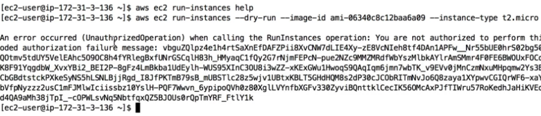
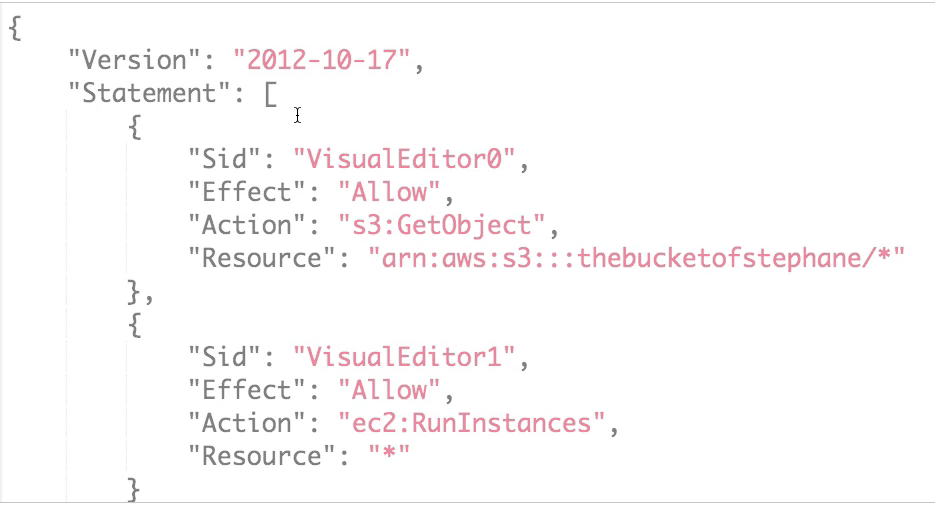
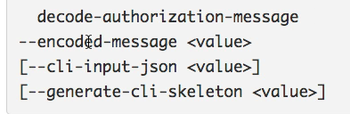
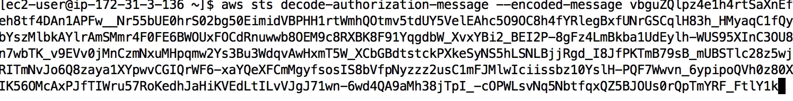
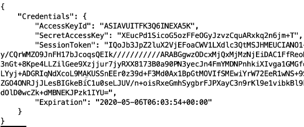
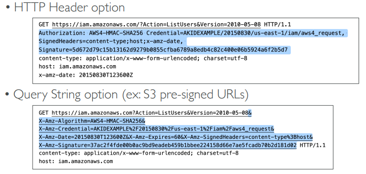

# CLI, SDK, IAM Policies and Roles 
- [CLI, SDK, IAM Policies and Roles](#cli-sdk-iam-policies-and-roles)
  - [AWS CLI Dry Runs](#aws-cli-dry-runs)
  - [AWS CLI STS Decode Errors](#aws-cli-sts-decode-errors)
  - [AWS EC2 Instance Metadata](#aws-ec2-instance-metadata)
  - [AWS CLI profile](#aws-cli-profile)
  - [MFA with CLI](#mfa-with-cli)
  - [AWS SDK Overview](#aws-sdk-overview)
  - [AWS Limits (Quotas)](#aws-limits-quotas)
  - [AWS CLI Credentials Provider Chain](#aws-cli-credentials-provider-chain)
    - [AWS Credentials Scenario](#aws-credentials-scenario)
    - [AWS Credentials Best Practices](#aws-credentials-best-practices)
  - [Signing AWS API requests](#signing-aws-api-requests)

## AWS CLI Dry Runs
- Sometimes, we’d just like to make sure we have the permissions…
- But not actually run the commands!
- Some AWS CLI commands (such as EC2) can become expensive if they 
succeed, say if we wanted to try to create an EC2 Instance
- Some AWS CLI commands (not all) contain a --dry-run option to 
simulate API calls 
- Creating a new instance with another instance with out proprt iam role. Note the **encoded autorization message**

- With proper iam role
- 
- 

## AWS CLI STS Decode Errors
- When you run API calls and they fail, you can get a long error message
- This error message can be decoded using the STS command line:
  - sts decode-authorization-message
  - 
- Add permission to give access to sts commands and then use the command 

- We get ugly json output, you can use vscode formatters to prettify it 

## AWS EC2 Instance Metadata
- AWS EC2 Instance Metadata is powerful but one of the least known features 
to developers
- It allows AWS EC2 instances to ”learn about themselves” without using an IAM Role for that purpose. 
- The URL is http://169.254.169.254/latest/meta-data
- You can retrieve the IAM Role name from the metadata, but you CANNOT 
retrieve the IAM Policy. 
- Metadata = Info about the EC2 instance 
- Userdata = launch script of the EC2 instance
## AWS CLI profile
- With --profile option, we can configure another aws account in the cli.
- To use this account. mention --profile <profile_name>

## MFA with CLI
- To use MFA with the CLI, you must create a temporary session
- To do so, you must run the STS GetSessionToken API call
- aws sts get-session-token --serial-number arn-of-the-mfa-device --token-code code-from-token --duration-seconds 3600
  
- It will give temporary credentials obtained from MFA
  
- You can use this to configure your aws account in the CLI 

## AWS SDK Overview
- What if you want to perform actions on AWS directly from your applications 
code ? (without using the CLI).
- You can use an SDK (software development kit) !
- We have to use the AWS SDK when coding against AWS Services such 
as DynamoDB
- Fun fact… the AWS CLI uses the Python SDK (boto3)
- The exam expects you to know when you should use an SDK
- We’ll practice the AWS SDK when we get to the Lambda functions
- Good to know: if you don’t specify or configure a default region, then 
**us-east-1 will be chosen by default**

## AWS Limits (Quotas)
- API Rate Limits
  - DescribeInstances API for EC2 has a limit of 100 calls per seconds
  - GetObject on S3 has a limit of 5500 GET per second per prefix
  - For Intermittent Errors: implement Exponential Backoff 
  - For Consistent Errors: request an API throttling limit increase
- Service Quotas (Service Limits)
  - Running On-Demand Standard Instances: 1152 vCPU
  - You can request a service limit increase by opening a ticket
  - You can request a service quota increase by using the Service Quotas API
  
**Exponential Backoff (any AWS service)**  
- When a request fails, the application waits for a short period of time before retrying the request. 
- If the request fails again, the application waits for a longer period of time before retrying. 
- If you get **ThrottlingException** intermittently, use exponential backoff
- Retry mechanism already included in AWS SDK API calls 
- Must implement yourself if using the AWS API as-is or in specific cases
  - Must only implement the retries on 5xx server errors and throttling
  - Do not implement on the 4xx client errors

## AWS CLI Credentials Provider Chain
**The CLI will look for credentials in this order**
- Command line options – --region, --output, and --profile
- Environment variables – AWS_ACCESS_KEY_ID,AWS_SECRET_ACCESS_KEY, 
and AWS_SESSION_TOKEN
- CLI credentials file –aws configure 
  - aws/credentials on Linux / Mac & C:\Users\user- aws\credentials on Windows
- CLI configuration file – aws configure
  - aws/config on Linux / macOS & C:\Users\USERNAME- aws\config on Windows
- Container credentials – for ECS tasks
- Instance profile credentials – for EC2 Instance Profiles 
  - *An instance profile is a container for an AWS Identity and Access Management (IAM) role that you can use to pass role information to an EC2 instance when the instance starts.*

**The Java SDK (example) will look for credentials in this order**
1. Java system properties – aws.accessKeyId and aws.secretKey
2. Environment variables –
AWS_ACCESS_KEY_ID and AWS_SECRET_ACCESS_KEY
1. The default credential profiles file – ex at: ~/.aws/credentials, shared by many SDK
2. Amazon ECS container credentials – for ECS containers
3. Instance profile credentials– used on EC2 instances

### AWS Credentials Scenario
- An application deployed on an EC2 instance is using environment variables 
with credentials from an IAM user to call the Amazon S3 API. 
- The IAM user has S3FullAccess permissions. 
- The application only uses one S3 bucket, so according to best practices:
  - An IAM Role & EC2 Instance Profile was created for the EC2 instance
  - The Role was assigned the minimum permissions to access that one S3 bucket
- The IAM Instance Profile was assigned to the EC2 instance, but it still had 
access to all S3 buckets. Why? - **The credentials chain is still giving priorities to the environment variables**

### AWS Credentials Best Practices
- Overall, NEVER EVER STORE AWS CREDENTIALS IN YOUR CODE
- Best practice is for credentials to be inherited from the credentials chain
- If using working within AWS, use IAM Roles
  - => EC2 Instances Roles for EC2 Instances
  - => ECS Roles for ECS tasks
  - => Lambda Roles for Lambda functions
- If working outside of AWS, use environment variables / named profiles
- When you configure AWS credentials on an EC2 instance, the credentials are stored in the instance's environment variables and configuration files. Any application running on that instance can access these variables and files to authenticate with AWS services.

## Signing AWS API requests

• When you call the AWS HTTP API, you sign the request so that AWS 
can identify you, using your AWS credentials (access key & secret key)
• Note: some requests to Amazon S3 don’t need to be signed
• If you use the SDK or CLI, the HTTP requests are signed for you
• You should sign an AWS HTTP request using Signature v4 (SigV4)

