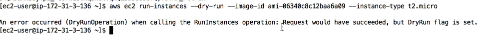

# CLI, SDK, IAM Policies and Roles 
- [CLI, SDK, IAM Policies and Roles](#cli-sdk-iam-policies-and-roles)
  - [AWS CLI Dry Runs](#aws-cli-dry-runs)
  - [AWS CLI STS Decode Errors](#aws-cli-sts-decode-errors)

## AWS CLI Dry Runs
- Sometimes, we’d just like to make sure we have the permissions…
- But not actually run the commands!
- Some AWS CLI commands (such as EC2) can become expensive if they 
succeed, say if we wanted to try to create an EC2 Instance
- Some AWS CLI commands (not all) contain a --dry-run option to 
simulate API calls 
- Creating a new instance with another instance with out proprt iam role. Note the **encoded autorization message**

- With proper iam role
- 
- 

## AWS CLI STS Decode Errors
- When you run API calls and they fail, you can get a long error message
- This error message can be decoded using the STS command line:
  - sts decode-authorization-message
  - 
- Add permission to give access to sts commands and then use the command 

- We get ugly json output, you can use vscode formatters to prettify it 

