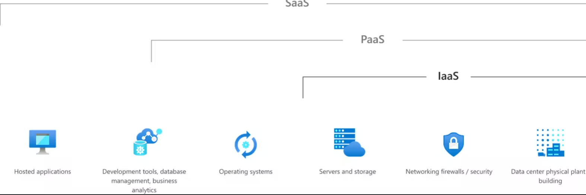
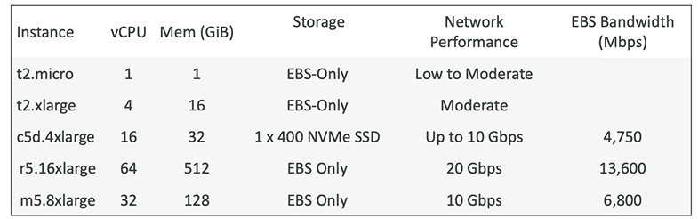
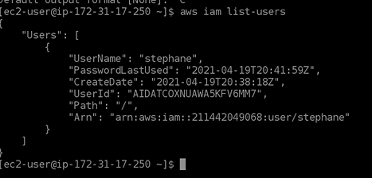

**Note**: `Before exploring the further services of aws, please create a budget plan in your budget. Free cost budget plan is recommeded if you only want to use free tier for education`

# EC2_Basics
**Topics**:
- [EC2\_Basics](#ec2_basics)
  - [What is EC2](#what-is-ec2)
  - [EC2 Sizing \& Configuring Options](#ec2-sizing--configuring-options)
  - [Launching an EC2 instance](#launching-an-ec2-instance)
  - [EC2 Instance Types](#ec2-instance-types)
    - [General Purpose](#general-purpose)
    - [Compute Optimized](#compute-optimized)
    - [Memory Optimised](#memory-optimised)
    - [Storage Optimized Instances](#storage-optimized-instances)
  - [Security Groups](#security-groups)
  - [Security Groups Hands on](#security-groups-hands-on)
  - [Connecting to EC2](#connecting-to-ec2)
    - [By SSH Client (in local CLI)](#by-ssh-client-in-local-cli)
    - [Instance Connect](#instance-connect)
    - [Analogy](#analogy)
  - [EC2 Instances Purchasing Options](#ec2-instances-purchasing-options)
    - [EC2 On Demand](#ec2-on-demand)
    - [EC2 Reserved Instances](#ec2-reserved-instances)
    - [EC2 Savings Plans](#ec2-savings-plans)
    - [EC2 Spot Instances](#ec2-spot-instances)
    - [EC2 Dedicated Hosts](#ec2-dedicated-hosts)
    - [EC2 Dedicated Instances](#ec2-dedicated-instances)
    - [EC2 Capacity Reservations](#ec2-capacity-reservations)

## What is EC2
- EC2 = Elastic Compute Cloud = Infrastructure as a Service
- **Infrastructure as a service (IaaS)** is a type of cloud computing service that offers essential compute, storage, and networking resources on demand, on a pay-as-you-go basis. IaaS is one of the four types of cloud services, along with software as a service (SaaS), platform as a service (PaaS), and serverles

- It mainly consists in the capability of:
    - Renting virtual machines (EC2)
    - Storing data on virtual drives (EBS)
    - Distributing load across machines (ELB)
    - Scaling the services using an auto-scaling group (ASG)
  
## EC2 Sizing & Configuring Options
- Operating system **(OS)**: Linux, Windows and Mac OS
- How much compute power and cores (CPU)
- How much random-access memory (RAM)
- How much storage space:
  - Network attached (EBS & EFS)
  - Hardware (EC2 Instance store)
- Network card: speed of the card, Public IP address
- Firewall rules: Security group
- Bootstrap Script (Configure at first launch): **EC2 User data**
- It is possible to bootstrap our instances using an EC2 User data script.Bootstrapping means launching commands when a machine starts
- That script is only run once at the instance **first start**
- EC2 user data is used to automate boot tasks such as:
    - Installing updates
    - Installing software
    - Downloading common files from the internet
    - Anything you can think of
- EC2 instance types are:
      
- `t2.micro` is free on 12-month tier as 750 hours per month and 30 GB of EBS General purpose ssd storage

## Launching an EC2 instance

* Step 1: Go into the EC2 console->instances->launch instances

* Step 2: Add in the Name of the instance and choose the base instance as Amazon Linux, set the instance type

* Step 3: Create a new key pair

* Step 4: Set up network settings

* Step 5: Set up storage settings

* Step 6: Go to the advance settings and add the code to the User data - optional (This runs only the first time we launch the instance)

* Step 7: Launch the instance

* Step 8: View instances

* Step 9: Open the public ipv4 address

Note: `After everytime you restart an instance, the public ip will change but private ip will not`

* The Hostaname of our ec2 instance virtual server/machine will be the `private IP DNS Name` 

## EC2 Instance Types 

- AWS has the following naming convention:
`m5.2xlarge`
- m: instance class
-  5: generation (AWS improves them over time)
- 2xlarge: size within the instance class

### General Purpose

* Great for diversity of workloads such as web servers or code repositories 
* Balance between:
  * Compute
  * Memory
  * Storage
* In the course we are using the **t2.micro** which is a general purpose ec2 instance 
  
### Compute Optimized

* Great for compute-intensive tasks that require high performance processors:
  * Batch processing 
  * Media Transcoding 
  * High performance web servers
  * High performance conputing (HPC)
  * Scientific modelling & machine learning
  * Dedicated gaming servers

### Memory Optimised

* Fast performance for workloads that process large data sets in memory
* Use cases:
  * High performance, relational/non-relational databases
  * Distributed web scale cache stores
  * In-memory databases optimised for BI(Business Intelligence)
  * Applications performing real-time processing of bug unstructured data

### Storage Optimized Instances

* Great for storage-intensive tasks that require high, sequential read and write access to data sets on local storage
* Use cases:
  * High frequency online transaction (OLTP) systems
  * Relational and NoSQL databases 
  * Cache for in-memory databases (for example: Redis)
  * Data warehousing applications
  * Distributed file systems

## Security Groups 

* Security groups are fundamental of network security in AWS
* They control how traffic is allowed into or out of our EC2 instances

* Security groups only contain **allow** rules
* Security groups rule can reference by IP or by security group
* Security groups are acting as a "Firewall" on EC2 instances
* They regulate:
  * Access to ports 
  * Authorise IP ranges - IPV4 & IPV6
  * Control of inbound network (from other side to instance)
  * Control of outbound network (from the instance to other)

* Can be attached to multiple instances 
* Locked down to a region/VPC combination
* Does live "outside" the EC2 - if traffic is blocked the EC2 instance won't see it
* It's good to maintain one separate security group for SSH access
* **If your application is not accessible (time out), then its a security group issue**
* **If your application gives a "connection refused" error, then it's an application error or it's not launched**
* All inbound traffic is blocked by default
* All outbound traffic is authorised by default
*  Referencing other security groups 

* Important ports to know 
* 22 = SSH (Secure Shell) - log into Linux instance
   * **Secure Shell (SSH)** is a cryptographic network protocol used to secure network connections between computers over an unsecured network. It provides secure encrypted communications between two untrusted hosts over an insecure network.
   *  SSH is typically used to log into a remote machine and execute commands, but it also supports tunneling, forwarding TCP ports, and X11 connections.
   * SSH uses public-key cryptography to authenticate the remote computer and allow it to authenticate the user, if necessary. 
   * The most common use of SSH is to connect to a remote server, either to run commands or to transfer files using SFTP.
* 21 = FTP (File Transfer Protocol) - upload files to a file share
* 22 = SFTP (Secure File Transfer Protocol) - upload files using SSH
* 80 = HTTP - access unsecured websites
* 443 = HTTPS - access secured websites
* 3389 = RDP (Remote Desktop Protocol) - log into a Windows instance

## Security Groups Hands on 

* Step 1: Go to the EC2 dashboard and click on Networks and Security -> Security Groups

* Step 2: Check edit inbound rules where we can change the port access for our EC2 instance

* Default SSH configuation is:

    

## Connecting to EC2

### By SSH Client (in local CLI)
If your computer is on windows>=10
* Step 1: open power shell at the location you have your .pem file

* Step 2: write the command to connect to the instance

### Instance Connect

- We can do access the ec2 instance witout .pem file by using the connect button in the following ec2 instance in the console
- Never enter/configure your [AWS CLI](../IAM-AWS_CLI/AWS_CLI.md) access key and values in the instance connect terminal
- To give credentials to instance connect terminal, always use [IAM Roles](../IAM-AWS_CLI/IAM.md.md) and attach required IAM role to the EC2 instance

### Analogy
- "ec2-user" is the default user account created on Amazon Elastic Compute Cloud (EC2) instances running Amazon Linux, Amazon Linux 2, and other Amazon-supported distributions. 
- This user account has administrative privileges and can be used to perform system-level tasks and manage the instance. 
- When you connect using to an instance **Instance Connect**, it means like you enter in to that virtual machine (using SSH) as the default ec2-user and use the termial of that machine.
- If you configure aws CLI, then it will be permanently attached to the ec2-user terminal and thus can be stolen
- Instead, IAM roles give you access to defined services in aws without us configuring the CLI.

`Very Important to identify scenarios and usecases in the exam`
## EC2 Instances Purchasing Options
- On-Demand Instances – short workload, predictable pricing, pay by second
- Reserved (1 & 3 years)
- Reserved Instances – long workloads 
- Convertible Reserved Instances – long workloads with flexible instances
- Savings Plans (1 & 3 years) –commitment to an amount of usage, long workload
- Spot Instances – short workloads, cheap, can lose instances (less reliable)
- Dedicated Hosts – book an entire physical server, control instance placement
- Dedicated Instances – no other customers will share your hardware
- Capacity Reservations – reserve capacity in a specific AZ for any duration
  
### EC2 On Demand
- Pay for what you use:
- Linux or Windows - billing per second, after the first minute
- All other operating systems - billing per hour 
- Has the highest cost but no upfront payment
- No long-term commitment
- Recommended for short-term and un-interrupted workloads, where 
you can't predict how the application will behave

### EC2 Reserved Instances
- Up to 72% discount compared to On-demand
- You reserve a specific instance attributes (Instance Type, Region, Tenancy, OS)
- Reservation Period – 1 year (+discount) or 3 years (+++discount)
- Payment Options – No Upfront (+), Partial Upfront (++), All Upfront (+++)
- Reserved Instance’s Scope – Regional or Zonal (reserve capacity in an AZ)
- Recommended for steady-state usage applications (think database)
- You can buy and sell in the Reserved Instance Marketplace
- Convertible Reserved Instance
- Can change the EC2 instance type, instance family, OS, scope and tenancy
- Up to 66% discount
Note: the % discounts are different from the video as AWS 
change them over time – the exact numbers are not needed 
for the exam. This is just for illustrative purposes J

### EC2 Savings Plans
- Get a discount based on long-term usage (up to 72% - same as RIs)
- Commit to a certain type of usage ($10/hour for 1 or 3 years)
- Usage beyond EC2 Savings Plans is billed at the On-Demand price
- Locked to a specific instance family & AWS region (e.g., M5 in us-east-1)
- Flexible across:
- Instance Size (e.g., m5.xlarge, m5.2xlarge)
- OS (e.g., Linux, Windows)
- Tenancy (Host, Dedicated, Default)

### EC2 Spot Instances
- Can get a discount of up to 90% compared to On-demand
- Instances that you can “lose” at any point of time if your max price is less than the 
current spot price
- The MOST cost-efficient instances in AWS
- Useful for workloads that are resilient to failure
- Batch jobs
- Data analysis
- Image processing
- Any distributed workloads
- Workloads with a flexible start and end time
- Not suitable for critical jobs or databases

### EC2 Dedicated Hosts
- A physical server with EC2 instance capacity fully dedicated to your use
- Allows you address compliance requirements and use your existing server- bound software licenses (per-socket, per-core, pe—VM software licenses)
- Purchasing Options:
- On-demand – pay per second for active Dedicated Host
- Reserved - 1 or 3 years (No Upfront, Partial Upfront, All Upfront)
- The most expensive option
- Useful for software that have complicated licensing model (BYOL – Bring Your Own License)
- Or for companies that have strong regulatory or compliance needs

### EC2 Dedicated Instances 
- Instances run on hardware that’s dedicated to you
- May share hardware with other 
instances in same account
- No control over instance placement 
(can move hardware after Stop / Start)

### EC2 Capacity Reservations
- Reserve On-Demand instances capacity in a specific AZ for any duration
- You always have access to EC2 capacity when you need it
- No time commitment (create/cancel anytime), no billing discounts
- Combine with Regional Reserved Instances and Savings Plans to benefit 
from billing discounts
- You’re charged at On-Demand rate whether you run instances or not
- Suitable for short-term, uninterrupted workloads that needs to be in a 
specific AZ

**Which purchasing option is right for me?**
- On demand: coming and staying in resort whenever we like, we pay the full price
- Reserved: like planning ahead and if we plan to stay for a long time, we may get a good discount.
- Savings Plans: pay a certain amount per hour for certain period and stay in any room type (e.g., 
King, Suite, Sea View, …)
- Spot instances: the hotel allows people to bid for the empty rooms and the highest bidder keeps the 
rooms. You can get kicked out at any time
- Dedicated Hosts: We book an entire building of the resort
- Capacity Reservations: you book a room for a period with full price even you don’t sta