# EC2_Storage

- [EC2\_Storage](#ec2_storage)
  - [EBS Volume](#ebs-volume)
    - [EC2 - EBS Relation](#ec2---ebs-relation)
    - [EBS - Delete on termination attribute](#ebs---delete-on-termination-attribute)
  - [EBS Hands on](#ebs-hands-on)
  - [EBS Snapshots](#ebs-snapshots)
    - [EBS Snapshot Features](#ebs-snapshot-features)
    - [EBS Snapshots - Hands on](#ebs-snapshots---hands-on)
  - [Amazon Machine Image (AMI)](#amazon-machine-image-ami)
  - [AMI Hands on](#ami-hands-on)
  - [EC2 Instance Store](#ec2-instance-store)
  - [EBS Volume Types](#ebs-volume-types)
    - [General Purpose SSD](#general-purpose-ssd)
    - [Provisioned IOPS (PIOPS) SSD](#provisioned-iops-piops-ssd)
    - [Hard Disk Drives (HDD)](#hard-disk-drives-hdd)
  - [EBS Multi-Attach – io1/io2 family](#ebs-multi-attach--io1io2-family)
  - [EFS – Elastic File System](#efs--elastic-file-system)
    - [EFS – Performance Classes](#efs--performance-classes)
    - [EFS – Storage Classes](#efs--storage-classes)
  - [EFS Hands-on](#efs-hands-on)
  - [Relation Througput, IOPS, Storage (Optional)](#relation-througput-iops-storage-optional)

## EBS Volume
* An EBS (Elastic Block Store) **volume** is a **network** drive you can attach to your instances while they run
* It allows your instances to persist data, even after their termination
* **They can only be mounted to one instance at a time** (at the CCP level)
* They are bound to a specific availability zone
* **Analogy**: Think of them as a "network USB stick"
* Free tier: 30 GB of free EBS storage of type General Purpose (SSD) or Magnetic per month
  
### EC2 - EBS Relation
  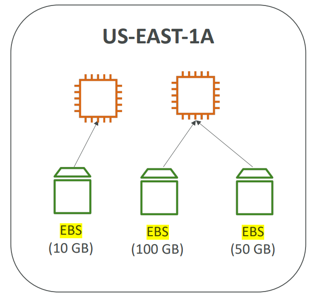
- It's a network drive (i.e. not a physical drive)
  - It uses the network to communicate the instance, which means there might be a bit of **latency**
  - It can be detached from an EC2 instance and attached to another one quickly
- It is locked to an Avaialibility Zone (AZ)
  - An EBS Volume in us-east-la zone cannot be attached to an instance in us-east-lb zone
  - To move a volume across, you need to first snapshot it
- Have a provisioned capacity (size in GBs, and IOPS)
  - You get billed for all the provisioned capacity
  - You can increase the capacity of the drive over time
  
### EBS - Delete on termination attribute

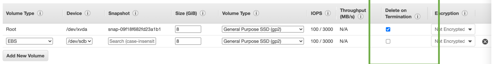

* Controls the EBS behaviour when an EC2 instance terminates
  * By default, the root EBS volume is deleted (attribute enabled)
  * A root volume refers to the default storage device associated with an Amazon Elastic Compute Cloud (EC2) instance. 
  * The root volume contains the operating system and other system-level software components required for the instance to function properly.
  * You can configure the root volume and additional volumes as needed to meet the storage and performance requirements of your application.
  * By default, any other attached EBS volume is not deleted (attribute disabled)
  * We can also replace the root volume

* This can be controlled by AWS Console / AWS CLI
* **Use Case: preserve root volume when instance is terminated**

## EBS Hands on

* Step 1: Go to EC2 dashboard and click on Volumes

* Step 2: Create a new volume

* Step 3: Click on the created volume in the volume dashboard and attach it to an instance

* Step 4: Check on the instance page, we have 2 volume attached to it

* Step 5: The first volume has delete on termination attribute so if I terminate the instance the first volume is going to get deletd and the second one will stay available

## EBS Snapshots
* EBS snapshots are point-in-time copies of EBS volumes and are immutable, meaning that they cannot be modified after they are created.
* Not necessary to detach volume to do a snapshot, but recommended
* Can copy snapshots in different **regions**

* We cannot directly use an EBS snapshot from one region to create an EBS volume in another region. **EBS snapshots are region-specific**, which means that they can only be used to create EBS volumes in the same region where the snapshot was taken.
* However, you can copy an EBS snapshot from one region to another and then use the copied snapshot to create a new EBS volume in the target region.
* This way, we can use two identical EBS volumes for two different instances (indirectly using one EBS for >1 instances)
* Snapshots are useful for disaster recovery (can copy a snapshot to different regions)

### EBS Snapshot Features

* **EBS Snapshot Archive**
  * Context: **Archiving** refers to the process of moving data, records, or other information that is no longer actively used, but must be retained for legal, regulatory, or business reasons, from an active storage location to a secondary storage location for long-term preservation. 
  * The goal of archiving is to keep the data safe, secure, and easily accessible, while freeing up space in the primary storage location to improve performance and reduce costs.
  * Move a Snapshot from standard storage tier to an "archive tier" that is 75% cheaper
  * Takes within 24 to 74hrs for restoring the archive

* **Recycling Bin**
  * Setup rules to retain deleted snapshots so you can recover them after an accidental deletion
  * Specify retention (from 1 day to 1 year) - Time period that the resources can be recovered after deletion (Just like recycle bin in windows)

* **Fast Snapshot Restore (FSR)**
  * Force full initialization of snapshot to have no latency on the first use - costly

### EBS Snapshots - Hands on

* Step 1: Go to the volumes dashboard and click on create a snapshot

* Step 2: Give description and create a snapshot

* Step 3: We can copy snapshot into different regions and also create a volume from it in different region

Also try working with the recycling bin

## Amazon Machine Image (AMI)
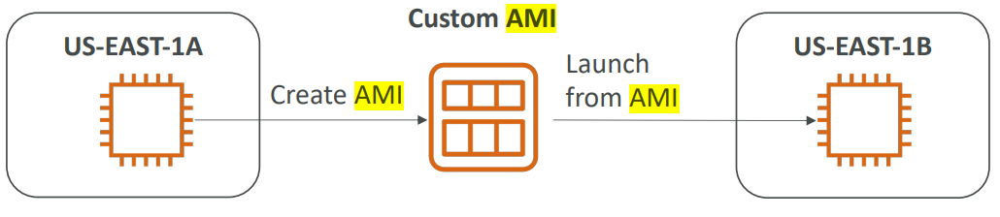
- AMI are a customization of an EC2 instance
- You add your own software, configuration, operating system, monitoring…
- Faster boot / configuration time because all your software is pre-packaged
- AMIs are built for a specific AWS Region, they're unique for each AWS Region. You can't launch an EC2 instance using an AMI in another AWS Region, but you can copy the AMI to the target AWS Region and then use it to create your EC2 instances.
- You can launch EC2 instances from:
  - A Public AMI: AWS provided
  - Your own AMI: you make and maintain them yourself
  - An AWS Marketplace AMI: an AMI someone else made (and potentially sells)
- Newly created EC2 instances can take large time to run [User Data](EC2_Basics.md) script and download softwares. But instances created from AMI already contain the software so take less time.
## AMI Hands on
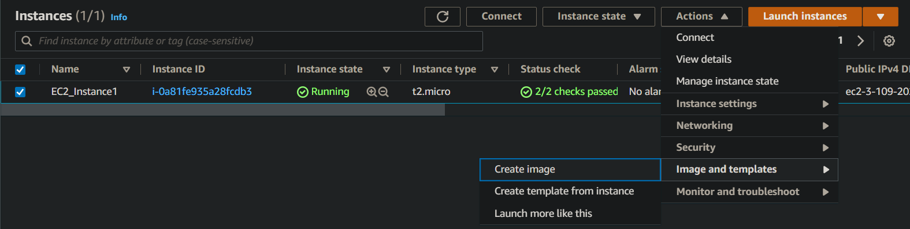

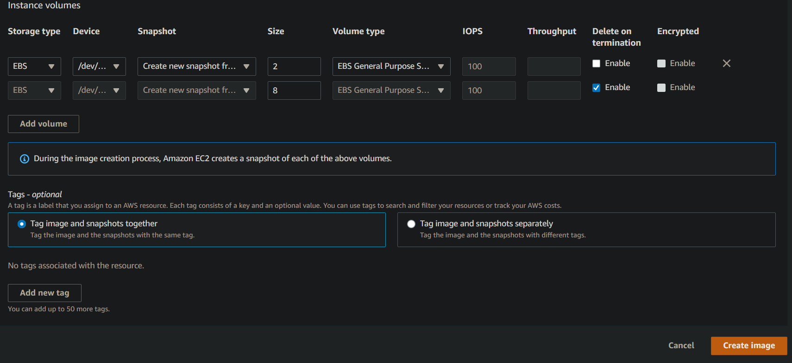

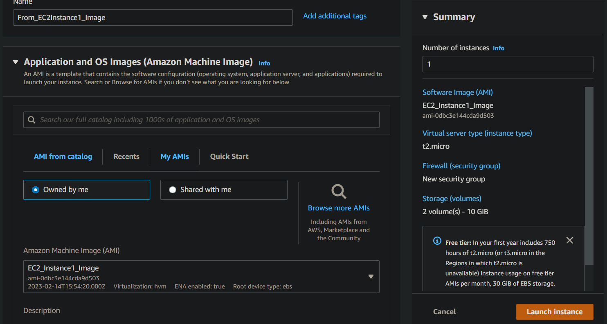

## EC2 Instance Store
- EBS volumes are network drives with good but “limited” performance
- If you need a high-performance hardware disk, use EC2 Instance Store
- Better I/O performance
- EC2 Instance Store lose their storage if they’re stopped (ephemeral)
- Good for buffer / cache / scratch data / temporary content 
- Risk of data loss if hardware fails
- Backups and Replication are your responsibility

## EBS Volume Types
EBS Volumes come in 6 types
- gp2 / gp3 (SSD): General purpose SSD volume that balances price and performance for 
a wide variety of workloads
- io1 / io2 (SSD): Highest-performance SSD volume for mission-critical low-latency or 
high-throughput workloads
- st1 (HDD): Low cost HDD volume designed for frequently accessed, throughput- intensive workloads
- sc1 (HDD): Lowest cost HDD volume designed for less frequently accessed workloads
- EBS Volumes are characterized in Size | Throughput | IOPS (I/O Ops Per Sec)
- When in doubt always consult the AWS documentation – it’s good!
- Only gp2/gp3 and io1/io2 can be used as boot volumes

**EBS Volume Types Use cases:**
### General Purpose SSD
- Cost effective storage, low-latency 
- System boot volumes, Virtual desktops, Development and test environments
- 1 GiB - 16 TiB
- **gp3:**
  - Baseline of 3,000 IOPS and throughput of 125 MiB/s
  - Can increase IOPS up to 16,000 and throughput up to 1000 MiB/s independently
- **gp2:**
  - Small gp2 volumes can burst IOPS to 3,000
  - Size of the volume and IOPS are linked, max IOPS is 16,000
  - 3 IOPS per GB, means at 5,334 GB we are at the max IOPS

### Provisioned IOPS (PIOPS) SSD
- Critical business applications with sustained IOPS performance
- Or applications that need more than 16,000 IOPS
- Great for databases workloads (sensitive to storage perf and consistency)
- **io1/io2** (4 GiB - 16 TiB):
  - Max PIOPS: 64,000 for Nitro EC2 instances & 32,000 for other
  - Can increase PIOPS independently from storage size
  - io2 have more durability and more IOPS per GiB (at the same price as io1)
- **io2 Block Express** (4 GiB – 64 TiB):
  - Sub-millisecond latency
  - Max PIOPS: 256,000 with an IOPS:GiB ratio of 1,000:1
  - Supports EBS Multi-attach 

### Hard Disk Drives (HDD) 
- Cannot be a boot volume 
- 125 GiB to 16 TiB 
-  Throughput Optimized HDD (st1)
-   Big Data, Data Warehouses, Log Processing 
-   Max throughput 500 MiB/s – max IOPS 500 
-   Cold HDD (sc1): 
    -   For data that is infrequently accessed
    -   Scenarios where lowest cost is important 
    -    Max throughput 250 MiB/s – max IOPS 250

## EBS Multi-Attach – io1/io2 family
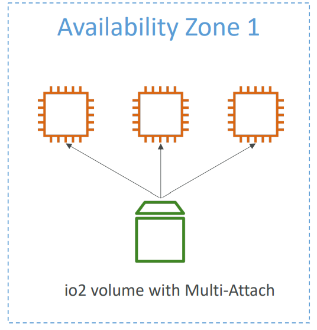
- Attach the same EBS volume to multiple EC2 
instances in the same AZ
- Each instance has full read & write permissions 
to the high-performance volume
- Use case:
  - Achieve higher application availability in clustered 
  Linux applications (ex: Teradata)
  - Applications must manage concurrent write 
  operations
  - `Up to 16 EC2 Instances at a time**`
  - Must use a file system that’s cluster-aware (not 
  XFS, EX4, etc…) 
  
## EFS – Elastic File System
- Managed [NFS (network file system)](../../Cloud_Basics.md) that can be mounted on many EC2
- EFS works with EC2 instances in multi-AZ (By default only across different zones in a single region)
- Highly available, scalable, expensive (3x gp2), pay per use
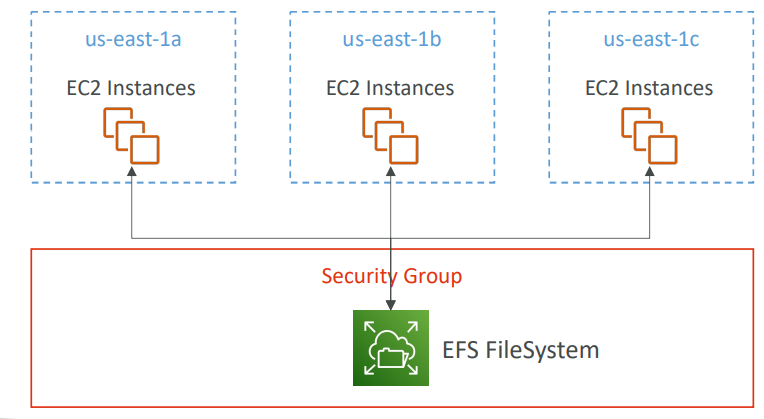
- Use cases: content management, web serving, data sharing, Wordpress
- Uses NFSv4.1 protocol
- Uses security group to control access to EFS
- Compatible with Linux based AMI (not Windows)
- Encryption at rest using KMS
- POSIX file system (~Linux) that has a standard file API
- File system scales automatically, pay-per-use, no capacity planning!
- Costlier than EBS

### EFS – Performance Classes
- EFS Scale
  - 1000s of concurrent NFS clients, 10 GB+ /s throughput
  - Grow to Petabyte-scale network file system, automatically
- Performance Mode (set at EFS creation time)
  - General Purpose (default) – latency-sensitive use cases (web server, CMS, etc…)
  - Max I/O – higher latency, throughput, highly parallel (big data, media processing) (High Latency)
- Throughput Mode
  - Bursting – 1 TB = 50MiB/s + burst of up to 100MiB/s
  - Provisioned – set your throughput regardless of storage size, ex: 1 GiB/s for 1 TB storage
  - Elastic – automatically scales throughput up or down based on your workloads
    - Up to 3GiB/s for reads and 1GiB/s for writes
    - Used for unpredictable workloads

### EFS – Storage Classes
- **Storage Tiers** 
  - lifecycle management feature – move file after N days
  - Standard: for frequently accessed files
  - Infrequent access (EFS-IA): cost to retrieve files, 
  lower price to store. Enable EFS-IA with a Lifecycle 
  Policy
  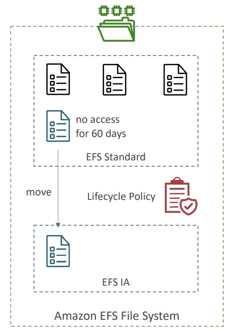
- **Availability and durability**
  - Standard: Multi-AZ, great for production
  - One Zone: One AZ, great for dev, backup enabled by default, compatible with IA (EFS One Zone-IA)
  - Over 90% in cost savings

## EFS Hands-on 

Open EFS and configure options based on requirements
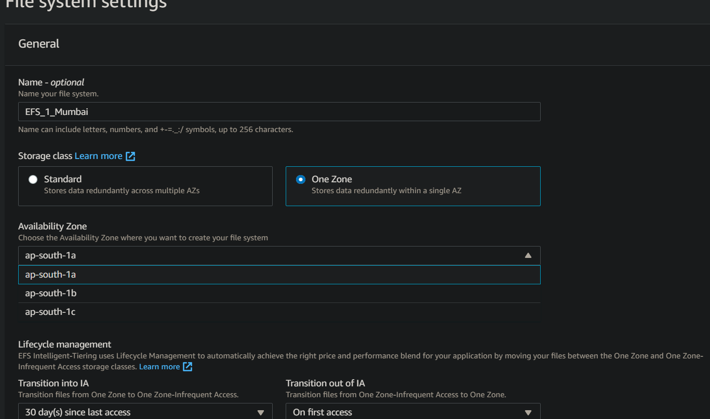

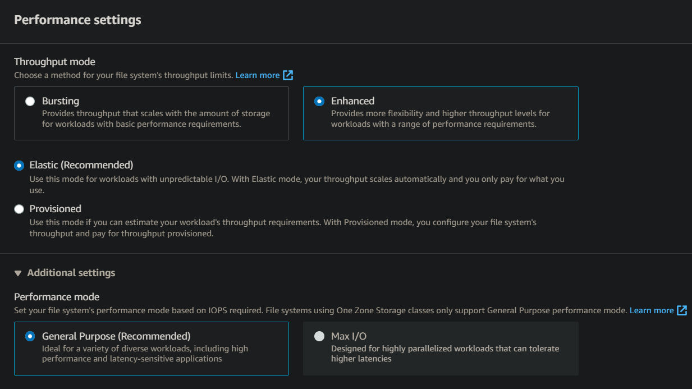

Create a security group with no inbound rules to attach to the mount points
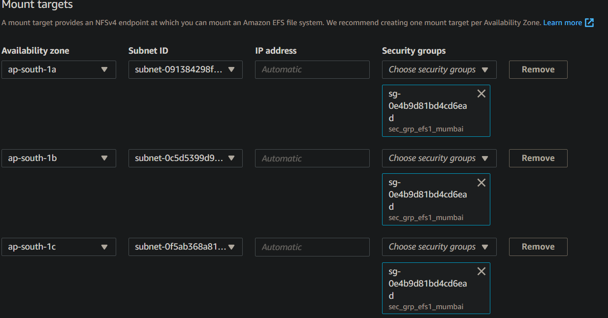

Now attach this EFS to different isntances at different zones in the same region.

For attaching EFS to 1A zone, set subnet of ec2 to 1A
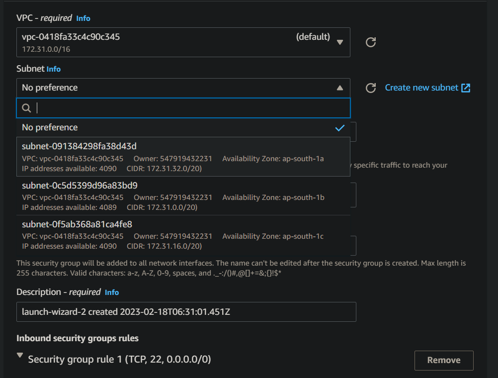

Attach EFS, it will automatically created security groups for both efs and the instance for mutual access. Note the mount point path, which will be used in instances.
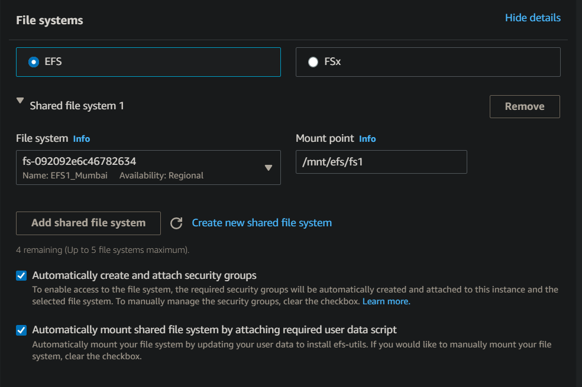

Repeat the same for other zones (B)

Connect to both instances and create files and check you must be acessing these files in both instances

## Relation Througput, IOPS, Storage (Optional)
- In AWS, there is a relationship between throughput, IOPS, and storage .

- **IOPS **(Input/Output Operations Per Second) is a measure of the number of read or write operations that can be performed on an EBS volume in a second. 
- **Throughput**, on the other hand, is a measure of the amount of data that can be read or written to an EBS volume in a second, and is typically measured in MB/s.

- The maximum IOPS and throughput that an EBS volume can achieve depend on the volume type and size. In general, larger EBS volumes can achieve higher IOPS and throughput than smaller volumes.

- Additionally, different EBS volume types have different IOPS and throughput limits. For example, the General Purpose SSD (gp2) volume type has a maximum of 16,000 IOPS and 250 MB/s throughput, while the Provisioned IOPS SSD (io1) volume type can provide up to 64,000 IOPS and 1,000 MB/s throughput.

- The storage capacity of an EBS volume also affects its IOPS and throughput performance. As the volume size increases, the number of IOPS that can be sustained by the volume also increases, up to the maximum limit for the volume type. 
- This is because the larger size allows for more parallelism in the I/O operations, enabling the volume to sustain higher IOPS.

- In summary, the relationship between throughput, IOPS, and storage in AWS is that the maximum IOPS and throughput that an EBS volume can achieve depends on the volume type and size, with larger volumes generally able to support higher IOPS and throughput.
-  Additionally, as the storage capacity of an EBS volume increases, its IOPS performance also increases, up to the maximum limit for the volume type.

