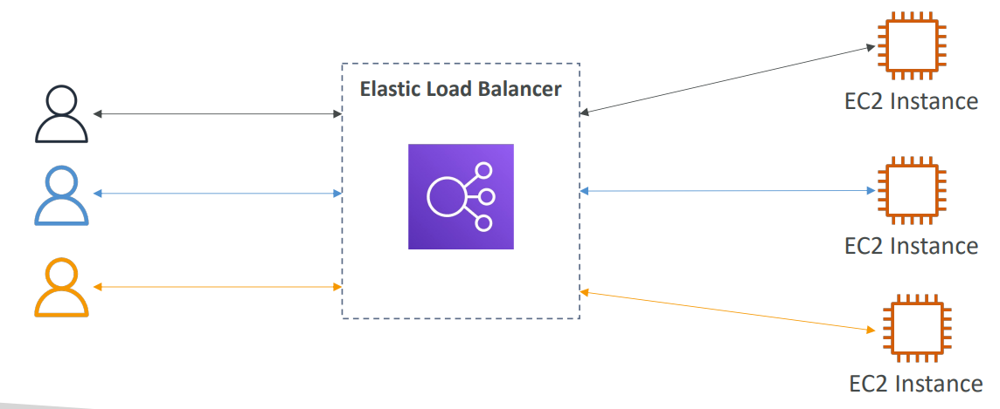
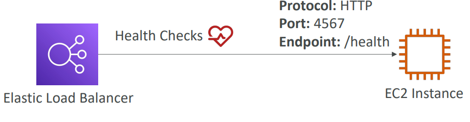
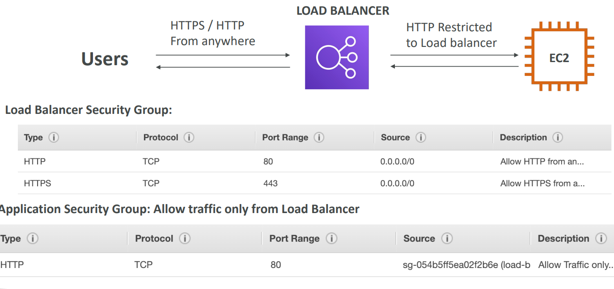

# Basics
- [Basics](#basics)
  - [Scalability](#scalability)
    - [Vertical Scalability](#vertical-scalability)
    - [Horizontal Scalability](#horizontal-scalability)
    - [High Availability](#high-availability)
    - [High Availability \& Scalability For EC2](#high-availability--scalability-for-ec2)
  - [Elastic Load Balancer](#elastic-load-balancer)

## Scalability 
- Scalability means that an application / system can handle greater loads 
by adapting. 
- There are two kinds of scalability:
- Vertical Scalability
- Horizontal Scalability (= elasticity)
- Scalability is linked but different to High Availability
- Let’s deep dive into the distinction, using a call center as an example

### Vertical Scalability
- Vertically scalability means increasing the size 
of the instance
- For example, your application runs on a 
t2.micro
- Scaling that application vertically means 
running it on a t2.large
- Vertical scalability is very common for non 
distributed systems, such as a database. 
- RDS, ElastiCache are services that can scale 
vertically. 
- There’s usually a limit to how much you can 
vertically scale (hardware limit)
- For example, upgrading junior opeartor to senior operator

### Horizontal Scalability
- Horizontal Scalability means increasing the 
number of instances / systems for your 
application
- Horizontal scaling implies distributed systems. - This is very common for web applications / 
modern applications
- It’s easy to horizontally scale thanks the cloud
- For example, increase no.of operators/workers
- 
### High Availability 
- High Availability usually goes hand in 
hand with horizontal scaling
- High availability means running your 
application / system in at least 2 data 
centers (== Availability Zones)
- The goal of high availability is to survive 
a data center loss
- The high availability can be passive (for 
RDS Multi AZ for example)
- The high availability can be active (for 
horizontal scaling)

### High Availability & Scalability For EC2
- Vertical Scaling: Increase instance size (= scale up / down)
  - From: t2.nano - 0.5G of RAM, 1 vCPU
  - To: u-12tb1.metal – 12.3 TB of RAM, 448 vCPUs
- Horizontal Scaling: Increase number of instances (= scale out / in)
  - Auto Scaling Group
  - Load Balancer
- High Availability: Run instances for the same application across multi AZ
  - Auto Scaling Group multi AZ
  - Load Balancer multi AZ

## Elastic Load Balancer 
- **Load Balances** are servers that forward traffic to multiple 
servers (e.g., EC2 instances) downstream

**Why use a load balancer?**
  -  Spread load across multiple downstream instances 
  -  Expose a single point of access (DNS) to your application 
  -  Seamlessly handle failures of downstream instances 
  -  Do regular health checks to your instances 
  -  Provide SSL termination (HTTPS) for your websites 
  -  Enforce stickiness with cookies 
  -  High availability across zones 
  -  Separate public traffic from private traffi  
  
**Why use an Elastic Load Balancer?**
  - An Elastic Load Balancer is a managed load balancer
  - AWS guarantees that it will be working
  - AWS takes care of upgrades, maintenance, high availability
  - AWS provides only a few configuration knobs
  - It costs less to setup your own load balancer but it will be a lot more effort on your end
  - It is integrated with many AWS offerings / services
    - EC2, EC2 Auto Scaling Groups, Amazon ECS
    - AWS Certificate Manager (ACM), CloudWatch
    - Route 53, AWS WAF, AWS Global Accelerator
 
**Health Checks**

- Health Checks are crucial for Load Balancers
- They enable the load balancer to know if instances it forwards traffic to 
are available to reply to requests
- The health check is done on a port and a route (/health is common)
- If the response is not 200 (OK), then the instance is unhealthy

**Load Balancer Security Groups**

  
- This picture shows that laod balancer can get invound HTTPS/HTTP traffic from anywhere, while Instance can get HTTPS/HTTP traffic from that load balancer alone.
- The security groups of instance and load balancer are connected together