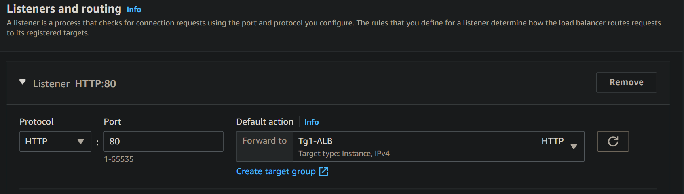

# Types of Load Balancers
- [Types of Load Balancers](#types-of-load-balancers)
  - [**Application Load Balancer (v2)**](#application-load-balancer-v2)
    - [ALB Hands on](#alb-hands-on)
  - [**Network Load Balancer**](#network-load-balancer)
  - [**Gateway Load Balancer**](#gateway-load-balancer)
  - [Sticky Sessions (Session Affinity)](#sticky-sessions-session-affinity)
  - [Cross-Zone Load Balancing](#cross-zone-load-balancing)
  - [SSL/TLS Certificates](#ssltls-certificates)
    - [SSL/TLS - Basics\*\*](#ssltls---basics)
    - [Load Balancer and SSL\*\*](#load-balancer-and-ssl)
    - [SSL – Server Name Indication (SNI)](#ssl--server-name-indication-sni)
    - [Elastic Load Balancers – SSL Certificates](#elastic-load-balancers--ssl-certificates)
  - [Connection Draining](#connection-draining)
  

## **Application Load Balancer (v2)**
- Application load balancers is Layer 7 (HTTP)
- Load balancing to multiple HTTP applications across machines 
(target groups)
- Load balancing to multiple applications on the same machine 
(ex: containers)
- Support for HTTP/2 and WebSocket
- Support redirects (from HTTP to HTTPS for example)
- Routing tables to different target groups:
   
  - Routing based on path in URL (example.com/users & example.com/posts)
  - Routing based on hostname in URL (one.example.com & other.example.com)
  - Routing based on Query String, Headers 
  (example.com/users?id=123&order=false)
- ALB are a great fit for micro services & container-based application 
(example: Docker & Amazon ECS)
- Has a port mapping feature to redirect to a dynamic port in ECS
- In comparison, we’d need multiple Classic Load Balancer per application
- **ALB - Target Groups**
   
  - EC2 instances (can be managed by an Auto Scaling Group) – HTTP 
  - ECS tasks (managed by ECS itself) – HTTP 
  - Lambda functions – HTTP request is translated into a JSON event
  - IP Addresses – must be private IPs
  - ALB can route to multiple target groups
  - Health checks are at the target group level
- Useful info
  - Fixed hostname (XXX.region.elb.amazonaws.com)
  - The application servers don’t see the IP of the client directly
  - The true IP of the client is inserted in the header X-Forwarded-For
  - We can also get Port (X-Forwarded-Port) and proto (X-Forwarded-Proto)
  - A Target Group in Amazon Web Services (AWS) can only contain instances or resources that are located within the **same region** as the Target Group.
  - This is because a Target Group is a **regional service** in AWS that is associated.
  - An **ALB or NLB** can only route traffic to resources that are located within the same region as the load balancer.

### ALB Hands on 
- Create two instances for creating a target group. Add User Data as well. Make sure to add security group that allows ssh and http traffic from any where. (like launch-wizard-1)
- Create a securtiy group that allows incming hhtp traffic from any where so could attach to load balancer
- Start creating load balancer, attach above sg 

  

- Add listener which defines target group to attach
  
  

- Now if can see our ec2 instances running in browser through both their individual hostnames(private DNS) and the common ALB hostname/DNS.
  
  

  

- We can observe, from alb dns we refresh , we get different hostnames because of load balancing

- To stop getting respone through instance dns, we can attach alb-sg to sg of these instances as source
  
   

- we can add rules to a listener of load balancer
  
  

  

## **Network Load Balancer**
  
- Network load balancers **(Layer 4)** allow to:
- Forward TCP & UDP traffic to your instances
- Handle millions of request per seconds
- Less latency ~100 ms (vs 400 ms for ALB)
- NLB has one static IP per AZ, and supports assigning Elastic IP
(helpful for whitelisting specific IP)
- NLB are used for extreme performance, TCP or UDP traffic
- Not included in the AWS free tier
- **Network Load Balancer –Target Groups**
  
  - EC2 instances
  - IP Addresses – must be private IPs
  - **Application Load Balancer**
  - Health Checks support the TCP, HTTP and HTTPS Protocols

## **Gateway Load Balancer**

- Deploy, scale, and manage a fleet of 3rd party network virtual appliances in AWS
- Example: Firewalls, Intrusion Detection and 
Prevention Systems, Deep Packet Inspection 
Systems, payload manipulation, …
- Operates at **Layer 3 (Network Layer)** – IP 
Packets
- Combines the following functions:
  - Transparent Network Gateway – single entry/exit for all traffic
  - Load Balancer – distributes traffic to your virtual appliances
- Uses the **GENEVE protocol on port 6081**

**Gateway Load Balancer –Target Groups**
- EC2 instances
- IP Addresses – must be private IPs
  
## Sticky Sessions (Session Affinity)
- It is possible to implement stickiness so that the 
same client is always redirected to the same 
instance behind a load balancer
- This works for Classic Load Balancers & 
Application Load Balancers
- The “cookie” used for stickiness has an 
expiration date you control
- Use case: make sure the user doesn’t lose his 
session data
- Enabling stickiness may bring imbalance to the 
load over the backend EC2 instances
- These cookies are set in the edit attributes of a target group
**Sticky Sessions – Cookie Names**
- Application-based Cookies
  - Custom cookie
    - Generated by the target
    - Can include any custom attributes required by the application
    - Cookie name must be specified individually for each target group 
    - Don’t use AWSALB, AWSALBAPP, or AWSALBTG (reserved for use by the ELB)
  - Application cookie
    - Generated by the load balancer
    - Cookie name is AWSALBAPP
- Duration-based Cookies
  - Cookie generated by the load balancer 
  - Cookie name is AWSALB for ALB, AWSELB for CLB

## Cross-Zone Load Balancing

- With cross-zone load balancing, ELB can distribute traffic across all the healthy registered instances in all the availability zones in a given region.
**Configurations**:
- Application Load Balancer 
  - Enabled by default (can be disabled at the Target Group level) - No charges for inter AZ data 
- Network Load Balancer & Gateway Load Balancer 
  - Disabled by default 
  - You pay charges ($) for inter AZ data if enabled 
- Classic Load Balancer 
  - Disabled by default 
  - No charges for inter AZ data if enable

## SSL/TLS Certificates
### SSL/TLS - Basics** 
- An SSL Certificate allows traffic between your clients and your load balancer 
to be encrypted in transit (in-flight encryption)
- SSL refers to Secure Sockets Layer, used to encrypt connections
- TLS refers to Transport Layer Security, which is a newer version
- Nowadays, TLS certificates are mainly used, but people still refer as SSL 
- Public SSL certificates are issued by Certificate Authorities (CA)
- Comodo, Symantec, GoDaddy, GlobalSign, Digicert, Letsencrypt, etc… 
- SSL certificates have an expiration date (you set) and must be renewed  
### Load Balancer and SSL**

- The load balancer uses an X.509 certificate (SSL/TLS server certificate)
- You can manage certificates using ACM (AWS Certificate Manager)
- You can create upload your own certificates alternatively
- HTTPS listener:
  - You must specify a default certificate
  - You can add an optional list of certs to support multiple domains
  - Clients can use SNI (Server Name Indication) to specify the hostname they reach
  - Ability to specify a security policy to support older versions of SSL / TLS (legacy clients)
### SSL – Server Name Indication (SNI)

- SNI solves the problem of loading multiple SSL certificates onto one web server (to serve multiple websites)
- It’s a “newer” protocol, and requires the client 
to indicate the hostname of the target server in the initial SSL handshake
- The server will then find the correct 
certificate, or return the default one  
**Note:**
- Only works for ALB & NLB (newer 
generation), CloudFront
- Does not work for CLB (older gen)
### Elastic Load Balancers – SSL Certificates
- Classic Load Balancer (v1)
  - Support only one SSL certificate
  - Must use multiple CLB for multiple hostname with multiple SSL certificates
- Application Load Balancer (v2)
  - Supports multiple listeners with multiple SSL certificates
  - Uses Server Name Indication (SNI) to make it work
- Network Load Balancer (v2)
  - Supports multiple listeners with multiple SSL certificates
  - Uses Server Name Indication (SNI) to make it work

## Connection Draining

- Feature naming
  - Connection Draining – for CLB
  - Deregistration Delay – for ALB & NLB
- Time to complete “in-flight requests” while the 
instance is de-registering or unhealthy
- When an instance is being taken out of service, either due to scaling down or during maintenance, the ELB will stop sending new requests to the instance. 
- However, there may still be some in-flight requests that are being processed by the instance. 
- Connection draining allows the instance to complete these in-flight requests before it is taken out of service, thereby ensuring that no requests are lost or terminated prematurely.
- Stops sending new requests to the EC2 
instance which is de-registering
- Between 1 to 3600 seconds (default: 300 
seconds)
- Can be disabled (set value to 0)
- Set to a low value if your requests are short

