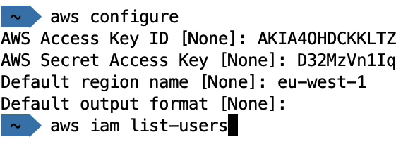

# AWS Command Line Interface

- AWS can be accessed by 3 methods:
  - **By management console (UI)**
     - It uses password + MFA for authentication
  - **By Command Line Interface**
     - It uses access keys for authentication
     - CLI has access to public API of aws 
     - We can automate tasks by writing scripts 
  - **By Software Development Kit (SDK)**
     - Language-specific APIs (set of libraries)
     - Enables you to access and manage AWS services
     programmatically by embedding in your application
     - Supports
        - SDKs (JavaScript, Python, PHP, .NET, Ruby, Java, Go, Node.js,
        - C++)
        - Mobile SDKs (Android, iOS, ....)
        - loT Device SDKs (Embedded C, ,Arduino, ...)
     - Example: AWS CLI is built on AWS SDK for Python

* Root user can create access keys for other users in the console
* Use `aws configure` command to set access key and Id and then the **iam user** can access his account in the CLI. `Never share Access credentials `
  
  The above credentials are dummy
* Can use cloud shell istead of local CLI