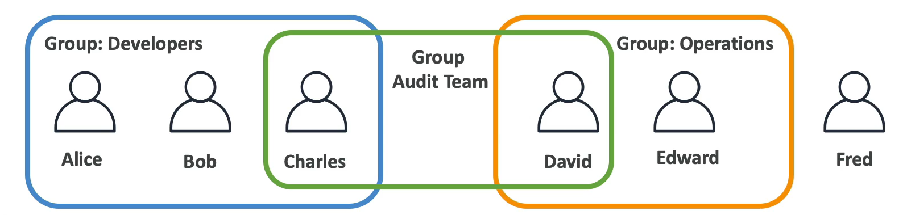
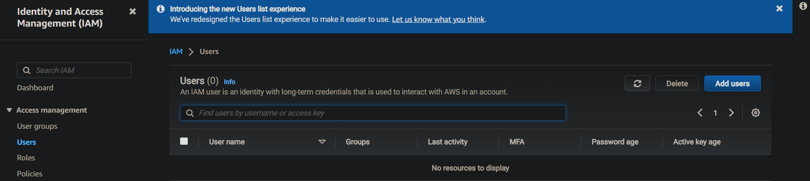
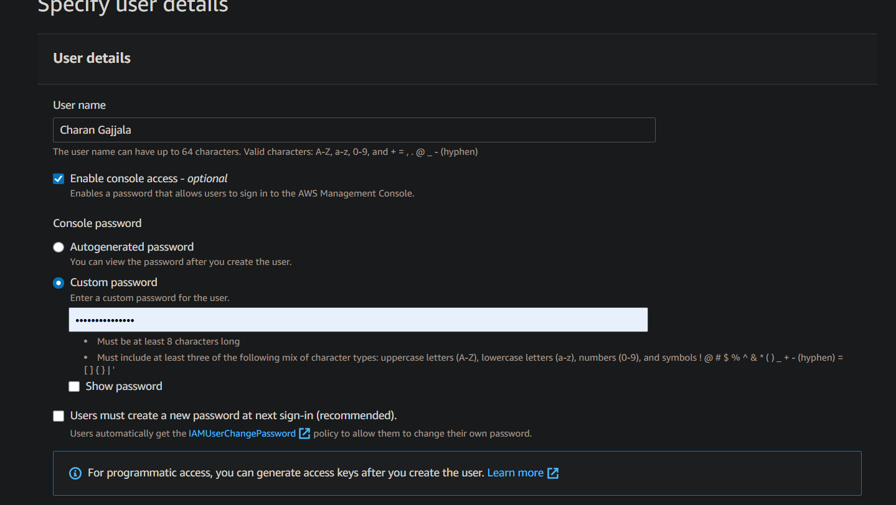
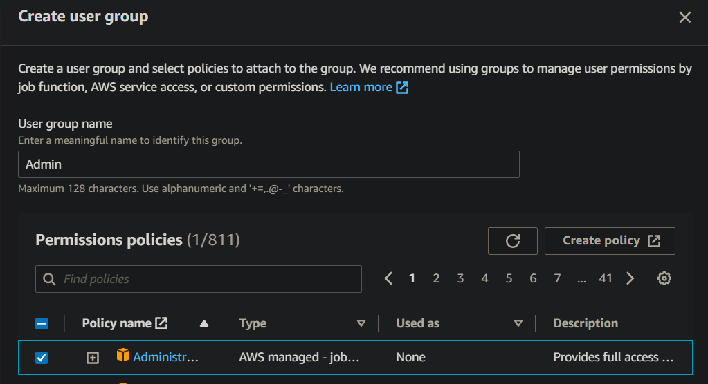
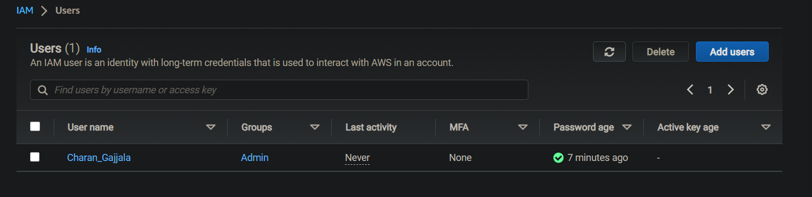
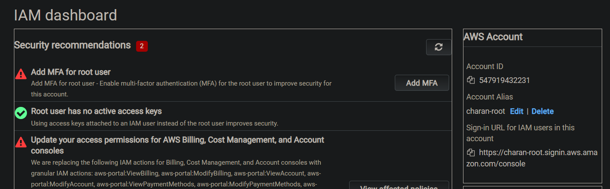
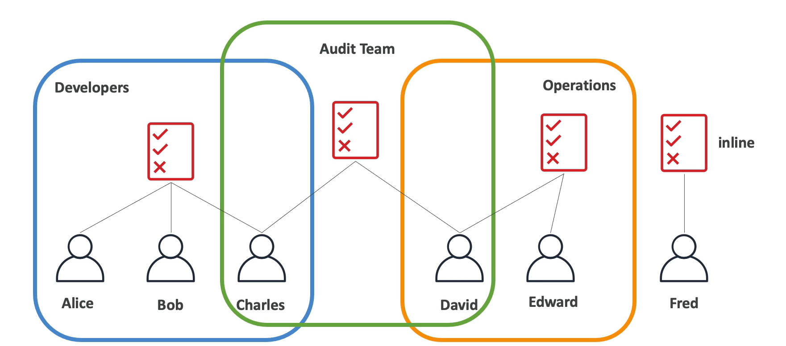
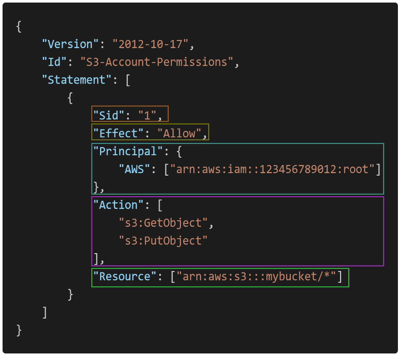
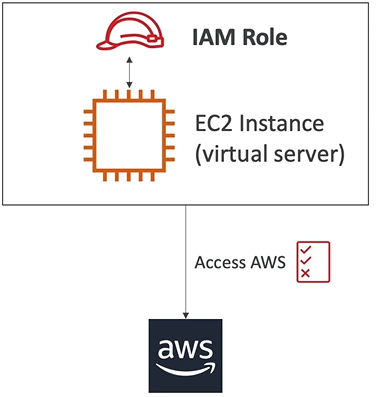

# Identity and Access Management (IAM) in AWS
**Topics**:
- [Identity and Access Management (IAM) in AWS](#identity-and-access-management-iam-in-aws)
  - [Users and Groups](#users-and-groups)
  - [IAM Permissions](#iam-permissions)
  - [Create an IAM user account](#create-an-iam-user-account)
  - [IAM policies](#iam-policies)
  - [Multi Factor Authentication (MFA) in AWS](#multi-factor-authentication-mfa-in-aws)
  - [IAM Roles](#iam-roles)
  - [IAM Security Tools](#iam-security-tools)
  - [Summary](#summary)

 
## Users and Groups

* IAM is a gloabl service, for example creation of Root account user
* Root account created by default, shouldn't be used or shared
* Users are people within your organization, and can be grouped. There are two kinds of users in AWS
   * Root User : Who has admin and unrestricted access
   * IAM User  : Who does business tasks in the company (Normal User)
* Groups only contain users, not other groups
* Users don't have to belong to a group, and user can belong to multiple groups

## IAM Permissions

* Permission are set for each use in the form of a policy in JSON syntax. This clearly defines what a user has to access to and what not
* In AWS, Least Privilege Principle is used which gives the only needed access to a user to avoid security issues and resouces misuses
  
## Create an IAM user account
The idea is that there is one **Root account under which all IAM users exist** and these users are managed by the root user. All these users are associated with the account id of the Root account.  

I have created a non-root user account for using the AWS services and gave admin permissions to it. Steps:

Login as Root User, go to services and go to IAM services by searching it.  
  
Go to Users and click ADD User

Fill the form as shown above

Create a group called Admin and give full resouces permission called arn:aws:iam::aws:policy/AdministratorAccess

Then, you can see user in userlist and its security credentials. There you find sign in link use it in incognito or other browerer to login, if already logged in with other account.

Change account alias of root account to a meaningful name and you are ready to login!

## IAM policies

Policies are inherited by the form of creating different groups. The red box below is a policy

A policy in JSON format mainly consists of

* **Version**: policy language version, always include "201 2-10-
* **Id**:an identifier for the policy (optional)
* **Statement**: one or more individual statements (required)
* Statements consists of
  * **Sid**: an identifier for the statement (optional)
  * **Effect**: whether the statement allows or denies access
  (Allow, Deny)
  * **Principal**: account/user/role to which this policy applied to
  * **Action**: list of actions this policy allows or denies
  * **Resource**: list of resources to which the actions applied to
  * **Condition**: conditions for when this policy is in effect
  (optional)
  
- A user can be attached a direct policy or a policies from groups
- We can create custom policies using JSON format or an interactive Visual Editor

## Multi Factor Authentication (MFA) in AWS 
* We can set passowrd policies for users like min lenght, patterns etc.
* But, password alone is not sufficient for security. Hence, its must to use MFA in aws
* Users have access to your account and can possibly change configurations or delete resources in your AWS account
* You want to protect your Root Accounts and IAM users
* MFA = password you know + security device you own
* Main benifi of MFA is that account is not compromised evn if the password is stolen
* We can change customize password policies in the root account to apply for IAM users 
* It is safe to use MFA for our account, but when the security device is lost then account cannot be recovered. Choose virtual authenticator app. Authy is recommended

## IAM Roles
  
- Some AWS service will need to
 perform actions on your behalf
- To do so, we will assign
 permissions to AWS services or other entities
with IAM Roles
- Common roles:
    EC2 Instance Roles,
    Lambda Function Roles,
    Roles for Cloud Formation
- Can create roles in the console. The process is to select a trust relationship which defines the type of entity you attach to the role, select use cases to define what this entity can do with your aws  and attach permission policies to it.
  
## IAM Security Tools
 - **IAM Credentials Report (account-level)** : a report that lists all your account's users and the status of their various
   credentials
 - **IAM Access Advisor (user-level)** : Access advisor shows the service permissions granted to a user and when those
   services were last accessed.
   You can use this information to revise your policies.

**Note**:  `According to the AWS Shared Responsibility Model, AWS infrastructure is an AWS responsibility`

## Summary
* Don't use the root account except for AWS account setup. Instead, use the IAM user with full admin access to all services 
* One physical user = One AWS user
* Assign users to groups and assign permissions to groups
* Create a strong password policy and Use and enforce the use of Multi Factor Authentication (MFA)
* Use Access Keys for Programmatic Access (CLI / SDK)
* Create and use Roles for giving permissions to AWS services
* Audit permissions of your account with the IAM security tools
  

  

