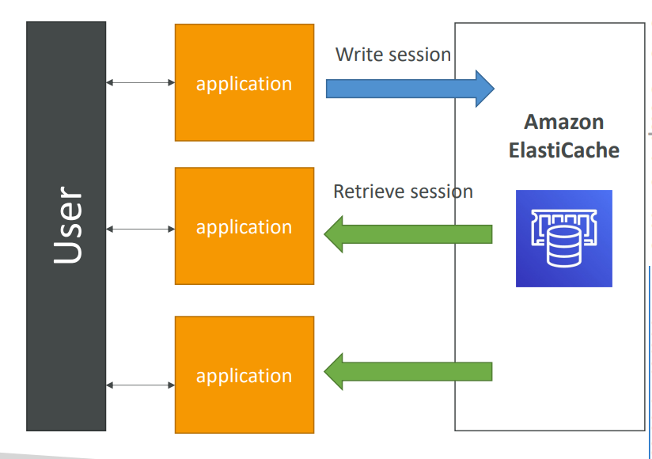
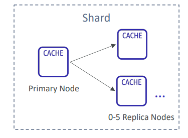
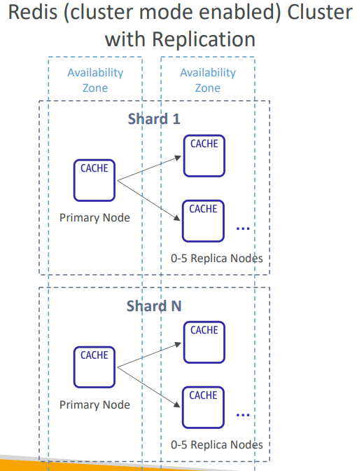
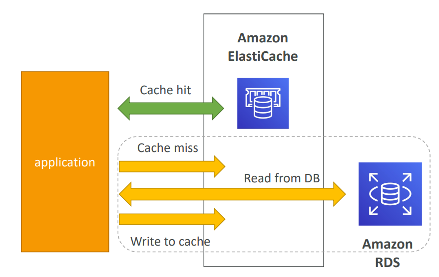
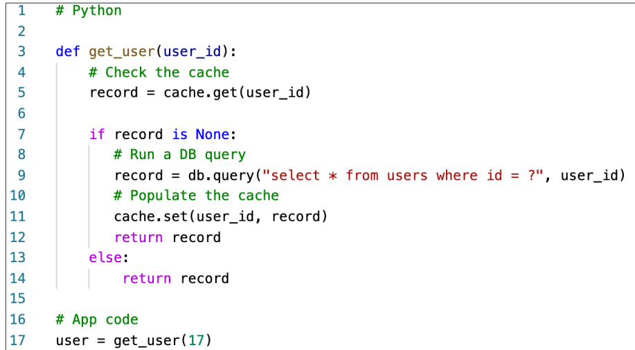
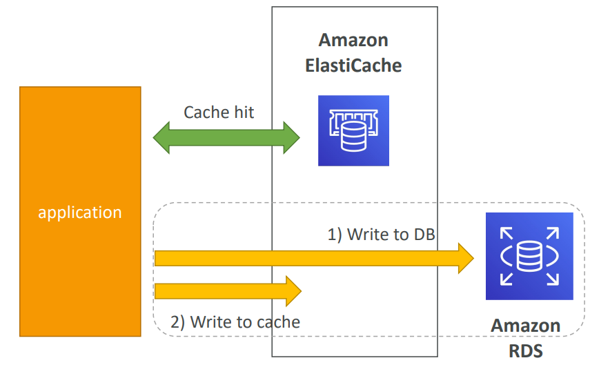
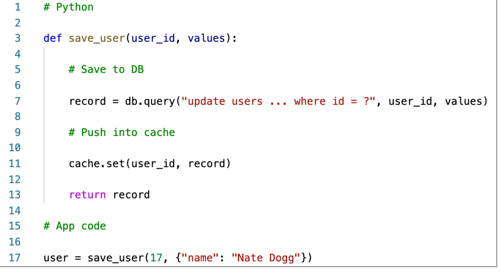

# Amazon ElastiCache
- [Amazon ElastiCache](#amazon-elasticache)
  - [ElastiCache Overview](#elasticache-overview)
  - [ElastiCache Solution Architecture](#elasticache-solution-architecture)
    - [DB Cache](#db-cache)
    - [User Session Store](#user-session-store)
  - [ElastiCache – Redis vs Memcached](#elasticache--redis-vs-memcached)
    - [REDIS](#redis)
    - [MEMCACHED](#memcached)
    - [ElastiCache Hands-on](#elasticache-hands-on)
    - [ElastiCache Replication: Cluster Mode Disabled](#elasticache-replication-cluster-mode-disabled)
    - [ElastiCache Replication: Cluster Mode Enabled](#elasticache-replication-cluster-mode-enabled)
  - [Caching Implementation Considerations](#caching-implementation-considerations)
    - [**Lazy Loading / Cache-Aside / Lazy Population**](#lazy-loading--cache-aside--lazy-population)
    - [**Write Through**](#write-through)
  - [Cache Evictions and Time-to-live (TTL)](#cache-evictions-and-time-to-live-ttl)
  - [Final words of wisdom](#final-words-of-wisdom)

## ElastiCache Overview
- The same way RDS is to get managed Relational Databases…
- ElastiCache is to get managed Redis or Memcached
- Caches are in-memory databases with really high performance, low 
latency
- Helps reduce load off of databases for read intensive workloads
- Helps make your application stateless
- AWS takes care of OS maintenance / patching, optimizations, setup, 
configuration, monitoring, failure recovery and backups
- Using ElastiCache involves heavy application code changes

## ElastiCache Solution Architecture 

### DB Cache

- Applications queries 
ElastiCache, if not 
available, get from RDS 
and store in ElastiCache.
- Helps relieve load in RDS
- Cache must have an 
invalidation strategy to 
make sure only the most 
current data is used in 
there. 

### User Session Store

- User logs into any of the 
application
- The application writes 
the session data into 
ElastiCache
- The user hits another 
instance of our 
application
- The instance retrieves the 
data and the user is 
already logged in

## ElastiCache – Redis vs Memcached
### REDIS 
- Multi AZ with Auto-Failover
- Read Replicas to scale reads 
and have high availability
- Data Durability using AOF 
persistence
- Backup and restore features
### MEMCACHED
- Multi-node for partitioning of 
data (sharding)
- No high availability (replication)
- Non persistent
- No backup and restore
- Multi-threaded architecture

### ElastiCache Hands-on 
- Create EC, choose Redis or Memecached and optin for various configurations including Multi-az, no.of replicas, node type (varying RAMs)
- choose cluster mode - enables replication across multiple shards. Disabled - The Redis cluster will have a single shard (node group
with one primary node and up to 5 read replica.
for enhanced scalability and availability.
- You get one primary endpoint and one reader endpoint
- connect to your application (complicated for now)

### ElastiCache Replication: Cluster Mode Disabled

- One primary node, up to 5 replicas
- Asynchronous Replication
- The primary node is used for read/write
- The other nodes are read-only
- One shard, all nodes have all the data
- Guard against data loss if node failure
- Multi-AZ enabled by default for failover
- Helpful to scale read performance

### ElastiCache Replication: Cluster Mode Enabled

- Data is partitioned across shards (helpful 
to scale writes)
- Each shard has a primary and up to 5 
replica nodes (same concept as before)
- Multi-AZ capability
- Up to 500 nodes per cluster:
    - 500 shards with single master
    - 250 shards with 1 master and 1 replica
    - …
    - 83 shards with one master and 5 replicas

## Caching Implementation Considerations
- Read more at: https://aws.amazon.com/caching/implementation- considerations/
- Is it safe to cache data? Data may be out of date, eventually consistent
- Is caching effective for that data? 
  - Pattern: data changing slowly, few keys are frequently needed
  - Anti patterns: data changing rapidly, all large key space frequently needed
- Is data structured well for caching?
  - example: key value caching, or caching of aggregations results
- Which caching design pattern is the most appropriate

### **Lazy Loading / Cache-Aside / Lazy Population**

- Pros
    - Only requested data is 
    cached (the cache isn’t filled 
    up with unused data)
    - Node failures are not fatal 
    (just increased latency to 
    warm the cache)
- Cons
    - Cache miss penalty that 
    results in 3 round trips, 
    noticeable delay for that 
    request
    - Stale data: data can be 
    updated in the database and 
    outdated in the cache

**Python Pseudocode**

### **Write Through** 

- Add or Update cache when database is updated
- Pros:
    - Data in cache is never 
    stale, reads are quick
    - Write penalty vs Read 
    penalty (each write 
    requires 2 calls)
- Cons:
    - Missing Data until it is 
    added / updated in the 
    DB. Mitigation is to 
    implement **Lazy Loading** 
    strategy as well
    - Cache churn – a lot of the 
    data will never be read

**Python Code**

## Cache Evictions and Time-to-live (TTL)
- Cache eviction can occur in three ways:
  - You delete the item explicitly in the cache
  - Item is evicted because the memory is full and it’s not recently used (LRU)
  - You set an item time-to-live (or TTL)
- TTL are helpful for any kind of data:
  - Leaderboards
  - Comments
  - Activity streams
- TTL can range from few seconds to hours or days
- If too many evictions happen due to memory, you should scale up or out

## Final words of wisdom
- Lazy Loading / Cache aside is easy to implement and works for many 
situations as a foundation, especially on the read side
- **Write-through is usually combined with Lazy Loading as targeted for the 
queries or workloads that benefit from this optimization**
- Setting a TTL is usually not a bad idea, except when you’re using Write- through. Set it to a sensible value for your application
- Only cache the data that makes sense (user profiles, blogs, etc…)
- **Quote:** There are only two hard things in Computer Science: cache 
invalidation and naming things

