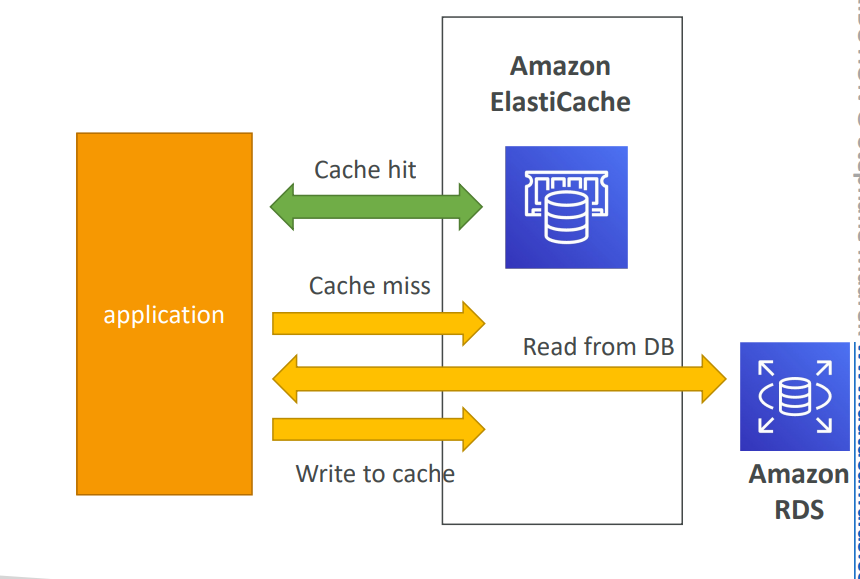

# Amazon ElastiCache

## ElastiCache Overview
- The same way RDS is to get managed Relational Databases…
- ElastiCache is to get managed Redis or Memcached
- Caches are in-memory databases with really high performance, low 
latency
- Helps reduce load off of databases for read intensive workloads
- Helps make your application stateless
- AWS takes care of OS maintenance / patching, optimizations, setup, 
configuration, monitoring, failure recovery and backups
- Using ElastiCache involves heavy application code changes

## ElastiCache Solution Architecture 

### DB Cache

- Applications queries 
ElastiCache, if not 
available, get from RDS 
and store in ElastiCache.
- Helps relieve load in RDS
- Cache must have an 
invalidation strategy to 
make sure only the most 
current data is used in 
there. 

### User Session Store

- User logs into any of the 
application
- The application writes 
the session data into 
ElastiCache
- The user hits another 
instance of our 
application
- The instance retrieves the 
data and the user is 
already logged in

## ElastiCache – Redis vs Memcached
### REDIS 
- Multi AZ with Auto-Failover
- Read Replicas to scale reads 
and have high availability
- Data Durability using AOF 
persistence
- Backup and restore features
### MEMCACHED
- Multi-node for partitioning of 
data (sharding)
- No high availability (replication)
- Non persistent
- No backup and restore
- Multi-threaded architecture

### ElastiCache Hands-on 
- Create EC, choose Redis or Memecached and optin for various configurations including Multi-az, no.of replicas, node type (varying RAMs)
- choose cluster mode - enables replication across multiple shards. Disabled - The Redis cluster will have a single shard (node group
with one primary node and up to 5 read replica.
for enhanced scalability and availability.
- You get one primary endpoint and one reader endpoint
- connect to your application (complicated for now)