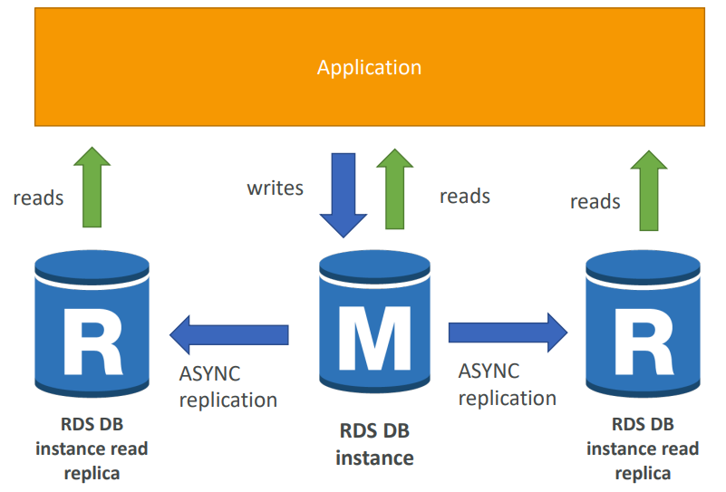
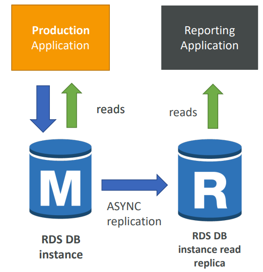
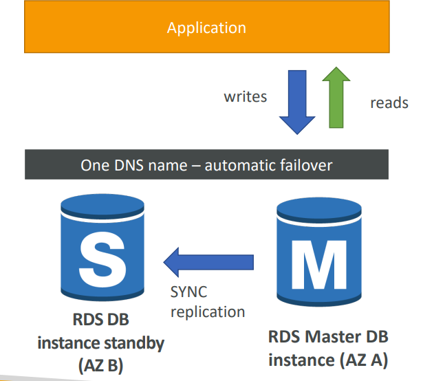
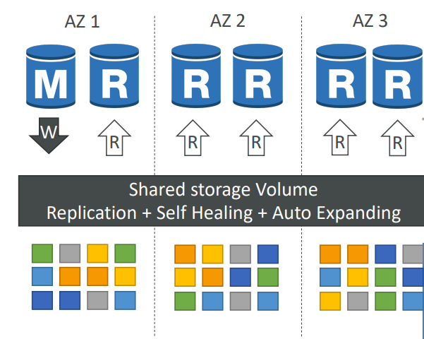
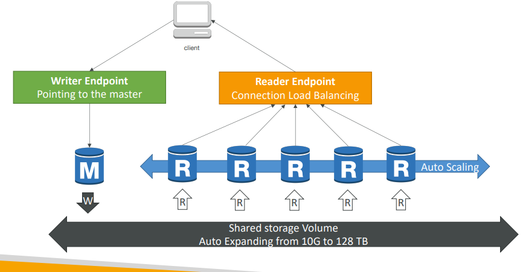

# RDS and Aurora
- [RDS and Aurora](#rds-and-aurora)
  - [Relational Database Service (RDS)](#relational-database-service-rds)
  - [**RDS Read Replicas for read scalability**](#rds-read-replicas-for-read-scalability)
    - [RDS Read Replicas – Use Cases](#rds-read-replicas--use-cases)
    - [RDS Read Replicas – Network Cost](#rds-read-replicas--network-cost)
  - [**RDS Multi AZ (Disaster Recovery)**](#rds-multi-az-disaster-recovery)
    - [RDS – From Single-AZ to Multi-AZ](#rds--from-single-az-to-multi-az)
  - [RDS Hands on](#rds-hands-on)
  - [**Amazon Aurora** (Very Important)](#amazon-aurora-very-important)
    - [Aurora High Availability and Read Scaling](#aurora-high-availability-and-read-scaling)
    - [Aurora DB Cluster](#aurora-db-cluster)
    - [Features of Aurora](#features-of-aurora)

## Relational Database Service (RDS)
- It’s a managed DB service for DB use SQL as a query language. 
- It allows you to create databases in the cloud that are managed by AWS
    - Postgres
    - MySQL
    - MariaDB
    - Oracle
    - Microsoft SQL Server
    - Aurora (AWS Proprietary database)  
  
**Advantage over using RDS versus deploying DB on EC2** 
- RDS is a managed service:
  - Automated provisioning, OS patching
  - Continuous backups and restore to specific timestamp (Point in Time Restore)!
  - Monitoring dashboards
  - Read replicas for improved read performance
  - Multi AZ setup for DR (Disaster Recovery)
  - Maintenance windows for upgrades
  - Scaling capability (vertical and horizontal)
  - Storage backed by EBS (gp2 or io1)
- BUT you can’t SSH into your RDS instances

**RDS – Storage Auto Scaling**
- Helps you increase storage on your RDS DB instance 
dynamically
- When RDS detects you are running out of free database 
storage, it scales automatically
- Avoid manually scaling your database storage 
- You have to set Maximum Storage Threshold (maximum limit for DB storage) 
- Automatically modify storage if: 
  - Free storage is less than 10% of allocated storage 
  - Low-storage lasts at least 5 minutes 
  - 6 hours have passed since last modification 
- Useful for applications with **unpredictable workloads** 
- Supports all RDS database engines (MariaDB, MySQL, 
PostgreSQL, SQL Server, Oracle)

## **RDS Read Replicas for read scalability**

- Up to 5 Read Replicas
- Within AZ, Cross AZ 
or Cross Region
- Replication is ASYNC, 
so reads are eventually 
consistent
- Read replicas use **asynchronous replication** to receive data from the primary instance.
- When a write request is made to the primary instance, the data is written to the primary instance's storage immediately (acknowledges application that data is written) and then sent to the replicas as soon as possible, without waiting for the replicas to confirm that they have received and written the data.
- There may be a slight delay in the read replica's data being completely up-to-date with the primary instance's data due to **replication lag**.
- Replicas can be 
promoted to their 
own DB
- Applications must 
update the connection 
string to leverage read 
replicas

### RDS Read Replicas – Use Cases

- You have a production database 
that is taking on normal load
- You want to run a reporting 
application to run some analytics
- You create a Read Replica to run 
the new workload there
- The production application is 
unaffected
- Read replicas are used for SELECT 
(=read) only kind of statements 
(not INSERT, UPDATE, DELETE)

### RDS Read Replicas – Network Cost
- In AWS there’s a network cost when data goes from one AZ to another 
- For RDS Read Replicas within the **same region**, you don’t pay that fee

## **RDS Multi AZ (Disaster Recovery)**

- In Amazon RDS Multi-AZ mode, **synchronous replication** is used to ensure that data is automatically replicated from the primary database instance to a secondary standby instance in a different availability zone for high availability and disaster recovery purposes.
- Only after data is written to both the primary and secondary, write operation is acknowledged to the application
- The secondary standby instance is always up-to-date with the primary instance, and in the event of a failure or maintenance of the primary instance, the standby instance can be promoted to become the new primary instance without any data loss or downtime. (This is called **Failover** of master instance to standby)
- Once the original primary instance is back online, it is synchronized with the new primary instance and becomes the new standby instance.
- One DNS name – automatic app failover to standby, no manual intervention in the application
- Not used for scaling
- Note: `The Read Replicas be setup as 
Multi AZ for Disaster Recovery (DR)`

### RDS – From Single-AZ to Multi-AZ
- Zero downtime operation (no 
need to stop the DB)
- Just click on “modify” for the 
database to enable muilti-az mode
- The following happens internally:
  - A snapshot is taken
  - A new DB is restored from the 
  snapshot in a new AZ
  - Synchronization is established 
  between the two databases

## RDS Hands on 
- Create RDS with desired DB engine and configurations
- You can select all the features above in the console.
- You will create an admin user and password and use that to authenticate and connect to the database through **3rd party client** (not ssh connection)
- Then as the admin user you can create db, tables etc.. in the RDS instance

## **Amazon Aurora** (Very Important)

- Aurora is a proprietary technology from AWS (**not open sourced**)
- Postgres and MySQL are both supported as Aurora DB (that means your 
drivers will work as if Aurora was a Postgres or MySQL database)
- Aurora is “AWS cloud optimized” and claims 5x performance improvement 
over MySQL on RDS, over 3x the performance of Postgres on RDS
- Aurora storage automatically grows in **increments of 10GB, up to 128 TB.** 
- Aurora can have **15 replicas** while MySQL has 5, and the replication process is faster (**sub 10 ms replica lag**)
- Failover in Aurora is instantaneous. It’s HA (High Availability) native. 
- Aurora costs more than RDS (20% more) – but is more efficient

### Aurora High Availability and Read Scaling

- **6 copies of your data across 3 AZ:**
  - 4 copies out of 6 needed for writes
  - 3 copies out of 6 need for reads
  - Self healing with peer-to-peer replication
  - Storage is striped across 100s of volumes
- One Aurora Instance takes writes (master)
- Automated failover for master in less than 
30 seconds (works through **replicas**)
- Shared storage volume (data will be replicated 2 copies for each zone)
- Master + up to 15 Aurora Read Replicas serve reads
- Support for Cross Region Replication

### Aurora DB Cluster

-  **A writer endpoint** is a cluster endpoint that is used for read-write operations. When you connect to the writer endpoint, you can perform both read and write operations on the Aurora cluster.
-  It points to the **upto date master instance**.All changes made to the database are immediately available at the writer endpoint.
-  **A reader endpoint** is associated with one or more read-only replicas of the Aurora cluster. These replicas are created using the same cluster volume as the primary instance, and they are continuously updated with changes from the primary instance. 
- No.of  Read Replicas are **auto scaled**, so you can have right number of replicas
- Read Connections are **load balanced** between the replicas
- Replication between the primary instance and the read replicas is **asynchronous by default**. However, Aurora implements a number of optimizations to ensure that replication is fast and reliable, even with high write volumes and read traffic.
  
### Features of Aurora
- Automatic fail-over
- Backup and Recovery
- Isolation and security
- Industry compliance
- Push-button scaling
- Automated Patching with Zero Downtime
- Advanced Monitoring
- Routine Maintenance
- **Backtrack**: restore data at any point of time without using backups
