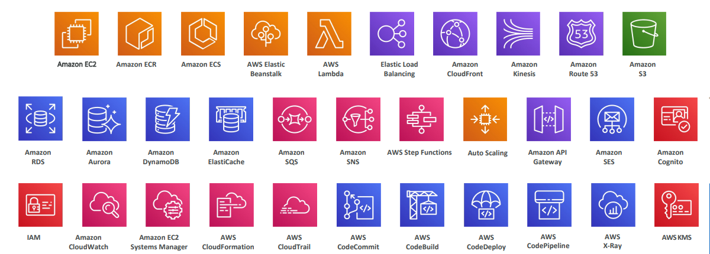

# These are the notes written while preparing for the developer associated certification from a udemy course called [Ultimate AWS Certified Developer Associate 2023 - NEW!](https://www.udemy.com/course/aws-certified-developer-associate-dva-c01/). These notes are for everyone to prepare and revise easily 😊. 

## We're going to learn all these services

## Topics:
* [Getting Started with AWS](GettingStartedWithAWS/AWS_Overview.md)
* [IAM and CLI](IAM-AWS_CLI/README.md)
* [EC2_Service](EC2_Service/README.md)
* [Scaling and Elastic Load Balancing](ELB+ASG/README.md)
* [RDS and ElastiCache](RDS_Aurora_ECache/README.md)
* [Route53](Route53/README.md)
* [Virtual Private Cloud (VPC)](VPC/vpc_basics.md)
* [Overall Architecure up to now](Solution_Architectures/Solution_Architectures.md)
* [Amazon S3](Amazon_S3/README.md)
* 
* 
* 
* 