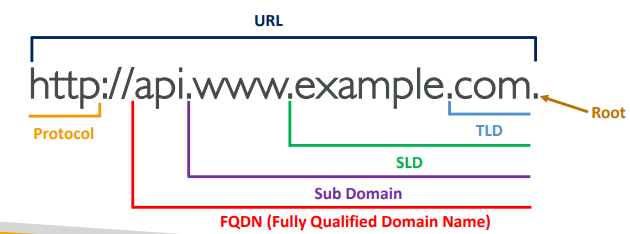
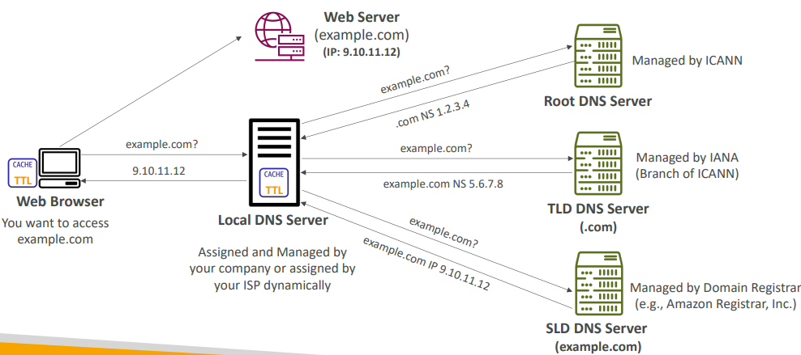
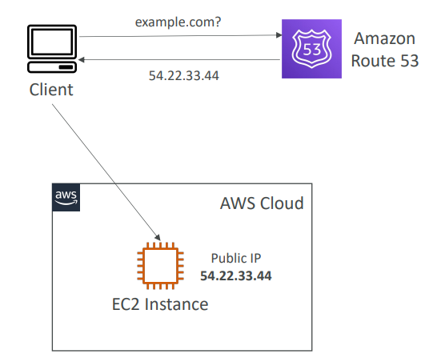
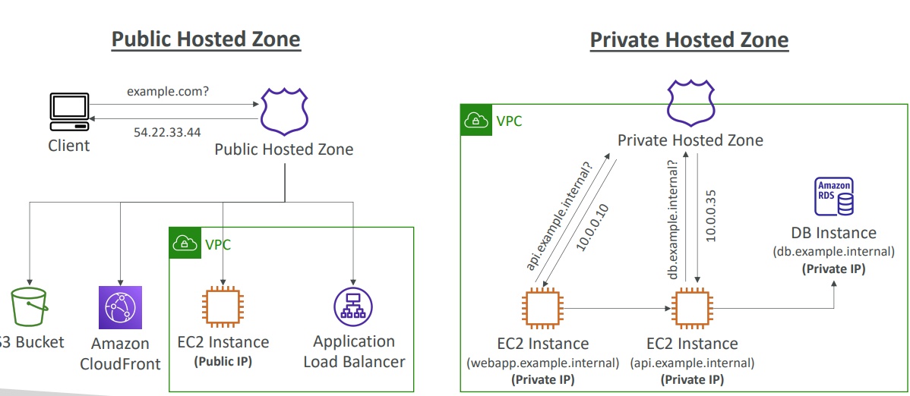

# Route53 Basics

## Domain Name System (DNS)
Domain Name System which translates the human friendly hostnames 
into the machine IP addresses
- www.google.com => 172.217.18.36
- DNS is the backbone of the Internet
- DNS uses hierarchical naming structure
    - .com
      - example.com
        - api.example.com
        - www.example.com
        - 
**DNS Terminologies**

- Domain Registrar: Amazon Route 53, GoDaddy, …
- DNS Records: A, AAAA, CNAME, NS, …
- Zone File: contains DNS records
- Name Server: resolves DNS queries (Authoritative or Non-Authoritative)
- Top Level Domain (TLD): .com, .us, .in, .gov, .org, …
- Second Level Domain (SLD): amazon.com, google.com, …

**How DNS Works**

- First, wen browser checks for fecthing IP of hostname in local dns server.
- If not found, asks to root dns server it reroutes to TLD name server, TLD reroutes to SLD name server.
- SLD name server is managed by **Domain Registrar: Amazon Route 53, GoDaddy,...**. This gives IP which will cached in Local dns server and given to client browser.

## Route53 Overview

- A highly available, scalable, fully 
managed and Authoritative DNS
  - Authoritative = the customer (you) 
  can update the DNS records 
- Route 53 is also a Domain Registrar
- Ability to check the health of your 
resources
- The only AWS service which 
provides 100% availability SLA
- Why Route 53? 53 is a reference to 
the traditional DNS port

### Records
How you want to route traffic for a domain
- Each record contains:
  - Domain/subdomain Name – e.g., example.com
  - Record Type – e.g., A or AAAA
  - Value – e.g., 12.34.56.78
  - Routing Policy – how Route 53 responds to queries
  - TTL – amount of time the record cached at DNS Resolvers
- Route 53 supports the following DNS record types:
  - (**must know**) A / AAAA / CNAME / NS
  - (advanced) CAA / DS / MX / NAPTR / PTR / SOA / TXT / SPF / SR
  - **A** – maps a hostname to IPv4
  - **AAAA** – maps a hostname to IPv6
  - **CNAME** – maps a hostname to another hostname
    - The target is a domain name which must have an A or AAAA record
    - Can’t create a CNAME record for the top node of a DNS namespace (Zone 
    Apex)
    - Example: you can’t create for example.com, but you can create for 
    www.example.com
  - **NS** – Name Servers for the Hosted Zone
    - Control how traffic is routed for a domain

## Hosted Zones

- A container for records that define how to route traffic to a domain and 
its subdomains
- **Public Hosted Zones** – contains records that specify how to route 
traffic on the Internet (public domain names)
application1.mypublicdomain.com
- **Private Hosted Zones** – contain records that specify how you route 
traffic within one or more VPCs (private domain names)
application1.company.internal
- You pay $0.50 per month per hosted zone

