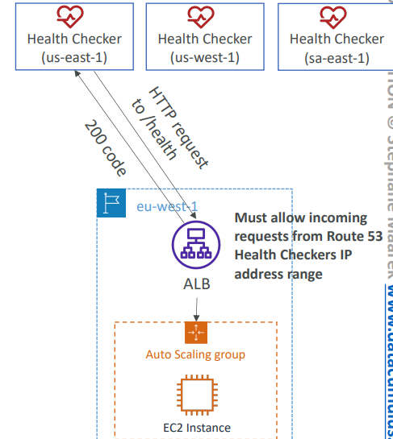
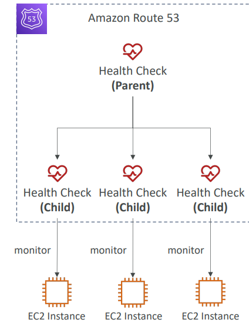

# Route53 Basics
- [Route53 Basics](#route53-basics)
  - [Domain Name System (DNS)](#domain-name-system-dns)
  - [Route53 Overview](#route53-overview)
  - [Records](#records)
  - [Hosted Zones](#hosted-zones)
  - [Route 53–Records TTL (Time To Live)](#route-53records-ttl-time-to-live)
  - [CNAME vs Alias](#cname-vs-alias)
  - [Alias Records](#alias-records)
  - [Route 53 Health Checks](#route-53-health-checks)
    - [Monitor an Endpoint](#monitor-an-endpoint)
    - [Calculated Health Checks](#calculated-health-checks)
    - [Private Hosted Zones](#private-hosted-zones)
  - [Domain Registar vs. DNS Service](#domain-registar-vs-dns-service)
  - [Route53 Hands-on](#route53-hands-on)

## Domain Name System (DNS)
Domain Name System which translates the human friendly hostnames 
into the machine IP addresses
- www.google.com => 172.217.18.36
- DNS is the backbone of the Internet
- DNS uses hierarchical naming structure
    - .com
      - example.com
        - api.example.com
        - www.example.com
        - 
**DNS Terminologies**

- Domain Registrar: Amazon Route 53, GoDaddy, …
- DNS Records: A, AAAA, CNAME, NS, …
- Zone File: contains DNS records
- Name Server: resolves DNS queries (Authoritative or Non-Authoritative)
- Top Level Domain (TLD): .com, .us, .in, .gov, .org, …
- Second Level Domain (SLD): amazon.com, google.com, …

**How DNS Works**

- First, wen browser checks for fecthing IP of hostname in local dns server.
- If not found, asks to root dns server it reroutes to TLD name server, TLD reroutes to SLD name server.
- SLD name server is managed by **Domain Registrar: Amazon Route 53, GoDaddy,...**. This gives IP which will cached in Local dns server and given to client browser.

## Route53 Overview

- A highly available, scalable, fully 
managed and Authoritative DNS
  - Authoritative = the customer (you) 
  can update the DNS records 
- Route 53 is also a Domain Registrar
- Ability to check the health of your 
resources
- The only AWS service which 
provides 100% availability SLA
- Why Route 53? 53 is a reference to 
the traditional DNS port

## Records
How you want to route traffic for a domain
- Each record contains:
  - Domain/subdomain Name – e.g., example.com
  - Record Type – e.g., A or AAAA
  - Value – e.g., 12.34.56.78
  - Routing Policy – how Route 53 responds to queries
  - TTL – amount of time the record cached at DNS Resolvers
- Route 53 supports the following DNS record types:
  - (**must know**) A / AAAA / CNAME / NS
  - (advanced) CAA / DS / MX / NAPTR / PTR / SOA / TXT / SPF / SR
  - **A** – maps a hostname to IPv4
  - **AAAA** – maps a hostname to IPv6
  - **CNAME** – maps a hostname to another hostname
    - The target is a domain name which must have an A or AAAA record
    - Can’t create a CNAME record for the top node of a DNS namespace (Zone 
    Apex)
    - Example: you can’t create for example.com, but you can create for 
    www.example.com
  - **NS** – Name Servers for the Hosted Zone
    - Control how traffic is routed for a domain

## Hosted Zones

- A container for records that define how to route traffic to a domain and 
its subdomains
- **Public Hosted Zones** – contains records that specify how to route 
traffic on the Internet (public domain names)
application1.mypublicdomain.com
- **Private Hosted Zones** – contain records that specify how you route 
traffic within one or more VPCs (private domain names)
application1.company.internal
- You pay $0.50 per month per hosted zone

## Route 53–Records TTL (Time To Live)

- High TTL – e.g., 24 hr
  - Less traffic on Route 53
  - Possibly outdated records
- Low TTL – e.g., 60 sec.
  - More traffic on Route 53 ($$)
  - Records are outdated for less 
  time
  - Easy to change records
- Except for Alias records, TTL 
is mandatory for each DNS 
record

## CNAME vs Alias
- AWS Resources (Load Balancer, CloudFront...) expose an AWS hostname: 
 - lb1-1234.us-east-2.elb.amazonaws.com and you want myapp.mydomain.com
- CNAME:
  - Points a hostname to any other hostname. (app.mydomain.com => blabla.anything.com)
  - ONLY FOR NON ROOT DOMAIN (aka. something.mydomain.com) 
- Alias: 
  - Points a hostname to an AWS Resource (app.mydomain.com => blabla.amazonaws.com) 
  - Works for ROOT DOMAIN and NON ROOT DOMAIN (aka mydomain.com) 
  - Free of charge 
  - Native health check

## Alias Records

- Maps a hostname to an AWS resource
- An extension to DNS functionality
- **Automatically recognizes changes in the 
resource’s IP addresses**
- Unlike CNAME, it can be used for the **top node** 
of a DNS namespace (Zone Apex), e.g.: 
example.com
- Alias Record is always of type **A/AAAA** for 
AWS resources (IPv4 / IPv6)
- You can’t set the TTL

**Targets**
- Elastic Load Balancers
- CloudFront Distributions
- API Gateway
- Elastic Beanstalk environments
- S3 Websites
- VPC Interface Endpoints
- Global Accelerator accelerator
- Route 53 record in the same hosted zone
- You cannot set an ALIAS record for an **EC2 DNS name**

## Route 53 Health Checks

- HTTP Health Checks are only for public 
resources
- Health Check => Automated DNS Failover:
1. Health checks that monitor an endpoint 
(application, server, other AWS resource)
2. Health checks that monitor other health 
checks (Calculated Health Checks)
3. Health checks that monitor CloudWatch 
Alarms (full control !!) – e.g., throttles of 
DynamoDB, alarms on RDS, custom metrics, 
… (helpful for private resources)
- Health Checks are integrated with CW 
metrics

### Monitor an Endpoint

- About 15 global health checkers will check the 
endpoint health
- Healthy/Unhealthy Threshold – 3 (default)
- Interval – 30 sec (can set to 10 sec – higher cost)
- Supported protocol: HTTP, HTTPS and TCP
- If > 18% of health checkers report the endpoint is 
healthy, Route 53 considers it Healthy. Otherwise, it’s 
Unhealthy
- Ability to choose which locations you want Route 53 to use
- Health Checks pass only when the endpoint 
responds with the 2xx and 3xx status codes
- Health Checks can be setup to pass / fail based on 
the text in the first 5120 bytes of the response
- Configure you router/firewall to allow incoming 
requests from Route 53 Health Checkers

### Calculated Health Checks

- Combine the results of multiple Health 
Checks into a single Health Check
- You can use OR, AND, or NOT
- Can monitor up to 256 Child Health Checks
- Specify how many of the health checks need 
to pass to make the parent pass
- **Usage: perform maintenance to your website without causing all health checks to fail**

### Private Hosted Zones

- Route 53 health checkers are outside the 
VPC
- They can’t access private endpoints 
(private VPC or on-premises resource)
- You can create a CloudWatch Metric and 
associate a CloudWatch Alarm, then 
create a Health Check that checks the 
alarm itself

## Domain Registar vs. DNS Service
- You buy or register your domain name with a Domain Registrar typically by 
paying annual charges (e.g., GoDaddy, Amazon Registrar Inc., …)
- The Domain Registrar usually provides you with a DNS service to manage 
your DNS records
- But you can use another DNS service to manage your DNS records
- Example: purchase the domain from GoDaddy and use Route 53 to manage 
your DNS records  

**3rd Party Registrar with Amazon Route 53**

- If you buy your domain on a 3rd party registrar, you can still use Route 
53 as the DNS Service provider
   - Create a Hosted Zone in Route 53
   - Update NS Records on 3rd party website to use Route 53 Name 
Servers
- Domain Registrar != DNS Service
- But every Domain Registrar usually comes with some DNS features

## Route53 Hands-on
- We can register a `domain_name` in aws but it costs 12/year
- After registering, we can create records with this domain, an A type record with "record_name" maps `record_name.domain_name.com` (sub domain) to an IPV4 Address.
- Create CNAME and Alais records to map to an ALB hostname and resource respectively.
- With CNAME , we cant map top level domain names (exampl.com) to another hostname but alias can map to resource
- We can use different routing policies on records to have control on different region level (ex latency policy). These records can be integrated with health checks to we can handle failovers of different regions.

