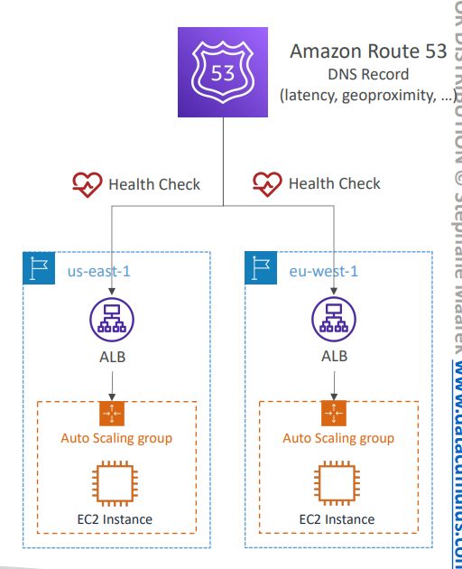
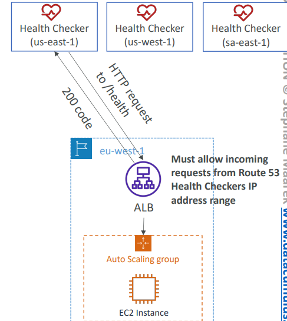
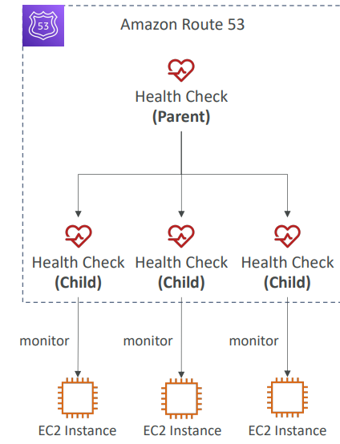
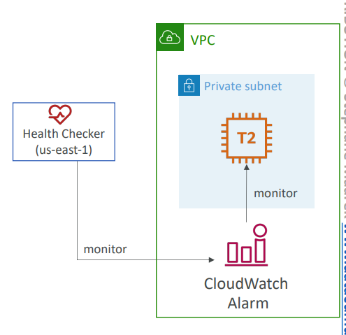

# Route53 Routing Policies

- [Route53 Routing Policies](#route53-routing-policies)
  - [Simple](#simple)
  - [Weighted](#weighted)
  - [Latency-based](#latency-based)
  - [Route 53 – Health Checks](#route-53--health-checks)
    - [Health Checks – Monitor an Endpoint](#health-checks--monitor-an-endpoint)
    - [Route 53 – Calculated Health Checks](#route-53--calculated-health-checks)
    - [Health Checks – Private Hosted Zones](#health-checks--private-hosted-zones)

## Simple
- Typically, route traffic to a single 
resource
- Can specify multiple values in the 
same record
- If multiple values are returned, a 
random one is chosen by the client
- When Alias enabled, specify only 
one AWS resource
- Can’t be associated with Health 
Checks

## Weighted

- Control the % of the requests that go to each 
specific resource
- Assign each record a relative weight:
- Weights don’t need to sum up to 100
- DNS records must have the same name and type
- Can be associated with Health Checks
- Use cases: load balancing between regions, testing 
new application versions…
- **Assign a weight of 0 to a record to stop sending 
traffic to a resource**
- If all records have **weight of 0**, then all records will be returned equally

## Latency-based

- Redirect to the resource that 
has the least latency close to us
- Super helpful when latency for 
users is a priority 
- **Latency is based on traffic 
between users and AWS 
Regions**
- **Germany users may be 
directed to the US (if that’s the 
lowest latency)**
- Can be associated with Health 
Checks (has a failover 
capability

## Route 53 – Health Checks

- HTTP Health Checks are only for public 
resources
- Health Check => Automated DNS Failover:
1. Health checks that monitor an endpoint 
(application, server, other AWS resource)
2. Health checks that monitor other health 
checks (Calculated Health Checks)
3. Health checks that monitor CloudWatch 
Alarms (full control !!) – e.g., throttles of 
DynamoDB, alarms on RDS, custom metrics, 
… (helpful for private resources)
- Health Checks are integrated with CW 
metrics

### Health Checks – Monitor an Endpoint

- About 15 global health checkers will check the 
endpoint health
- Healthy/Unhealthy Threshold – 3 (default)
- Interval – 30 sec (can set to 10 sec – higher cost)
- Supported protocol: HTTP, HTTPS and TCP
- If > 18% of health checkers report the endpoint is 
healthy, Route 53 considers it Healthy. Otherwise, it’s 
Unhealthy
- Ability to choose which locations you want Route 53 to use
- Health Checks pass only when the endpoint 
responds with the 2xx and 3xx status codes
- Health Checks can be setup to pass / fail based on 
the text in the first 5120 bytes of the response
- Configure you router/firewall to allow incoming 
requests from Route 53 Health Checkers

### Route 53 – Calculated Health Checks

- Combine the results of multiple Health 
Checks into a single Health Check
- You can use OR, AND, or NOT
- Can monitor up to 256 Child Health Checks
- Specify how many of the health checks need 
to pass to make the parent pass
- **Usage: perform maintenance to your website without causing all health checks to fail**

### Health Checks – Private Hosted Zones

- Route 53 health checkers are outside the 
VPC
- They can’t access private endpoints 
(private VPC or on-premises resource)
- You can create a CloudWatch Metric and 
associate a CloudWatch Alarm, then 
create a Health Check that checks the 
alarm itself