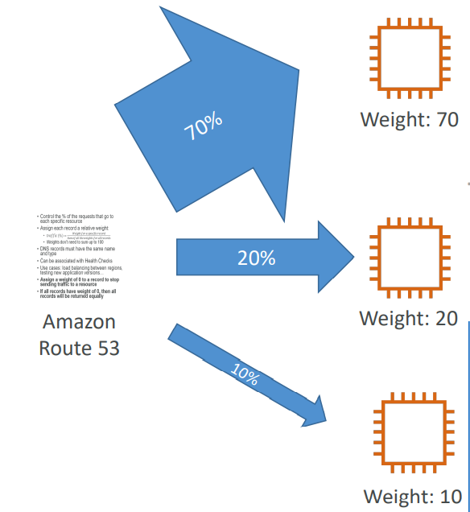
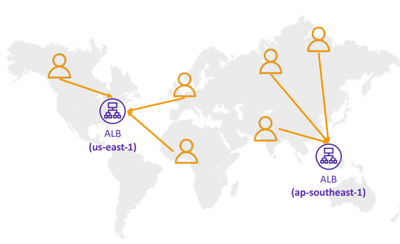
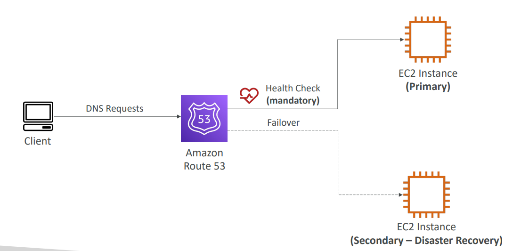
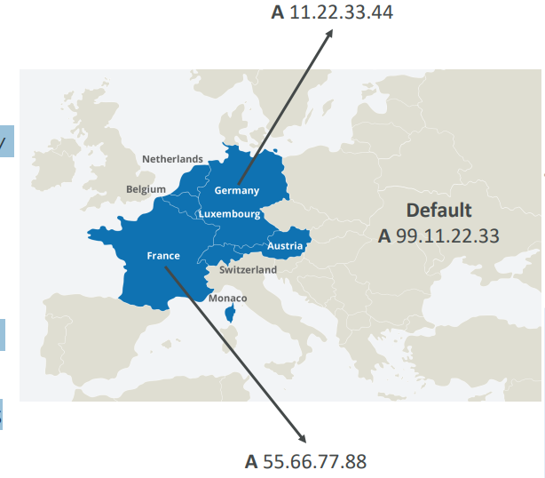
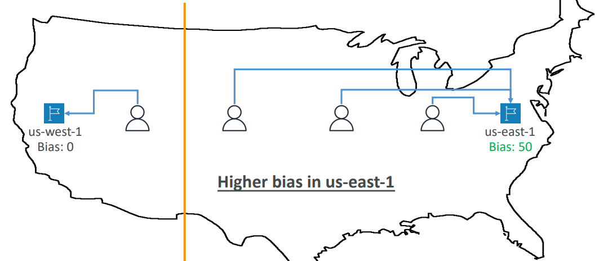
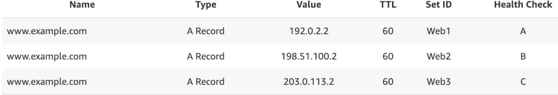

# Route53 Routing Policies

- [Route53 Routing Policies](#route53-routing-policies)
  - [Simple](#simple)
  - [Weighted](#weighted)
  - [Latency-based](#latency-based)
  - [FailOver](#failover)
  - [Geolocation](#geolocation)
  - [Geoproximity](#geoproximity)
  - [Multi-Value](#multi-value)
  - [Traffic flow](#traffic-flow)

## Simple
- Typically, route traffic to a single 
resource
- Can specify multiple values in the 
same record
- If multiple values are returned, a 
random one is chosen by the client
- When Alias enabled, specify only 
one AWS resource
- Can’t be associated with Health 
Checks

## Weighted

- Control the % of the requests that go to each 
specific resource
- Assign each record a relative weight:
- Weights don’t need to sum up to 100
- DNS records must have the same name and type
- Can be associated with Health Checks
- Use cases: **load balancing between regions**, testing 
new application versions…
- **Assign a weight of 0 to a record to stop sending 
traffic to a resource**
- If all records have **weight of 0**, then all records will be returned equally

## Latency-based

- Redirect to the resource that 
has the least latency close to us
- Super helpful when latency for 
users is a priority 
- **Latency is based on traffic 
between users and AWS 
Regions**
- **Germany users may be 
directed to the US (if that’s the 
lowest latency)**
- Can be associated with Health 
Checks (has a failover 
capability)

## FailOver

## Geolocation

- Different from **Latency-based!** 
- This routing is based on user location
- Specify location by Continent, Country 
or by US State (if there’s overlapping, 
most precise location selected)
- Should create a “Default” record (in 
case there’s no match on location)
- Use cases: website localization, restrict 
content distribution, load balancing, …
- Can be associated with Health Checks

## Geoproximity

- Route traffic to your resources based on the geographic location of users and 
resources in region level
- Ability to shift more traffic to resources based on the defined bias
  - To change the size of the geographic region, specify bias values:
  - To expand (1 to 99) – more traffic to the resource
  - To shrink (-1 to -99) – less traffic to the resource
- Resources can be:
  - AWS resources (specify AWS region)
  - Non-AWS resources (specify Latitude and Longitude)
  - You must use Route 53 Traffic Flow to use this feature
- If you want to distribute traffic evenly between multiple endpoints, regardless of location, use **weighted routing policy.**
-  If you want to direct users to the endpoint closest to them, use Geo proximity routing policy.

## Multi-Value

- Use when routing traffic to multiple resources
- Route 53 return multiple values/resources
- Can be associated with Health Checks (return only values for healthy resources)
- Up to 8 healthy records are returned for each Multi-Value query
- Multi-Value is not a substitute for having an ELB

## Traffic flow
- Simplify the process of creating and 
maintaining records in large and 
complex configurations
- Visual editor to manage complex 
routing decision trees
- Configurations can be saved as 
Traffic Flow Policy 
  - Can be applied to different Route 53 
  Hosted Zones (different domain 
  names)
  - Supports versioning

