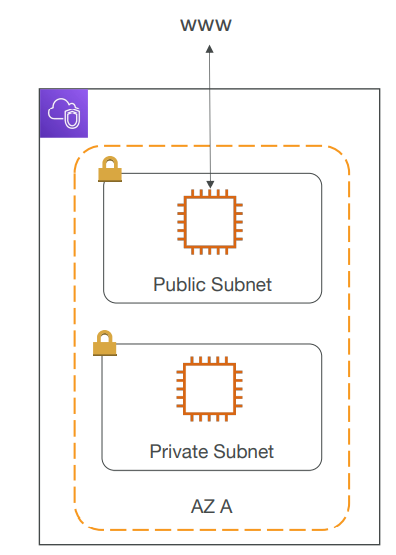
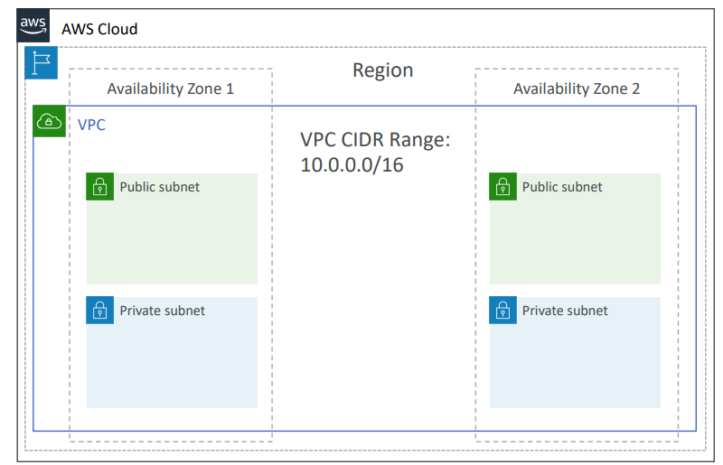
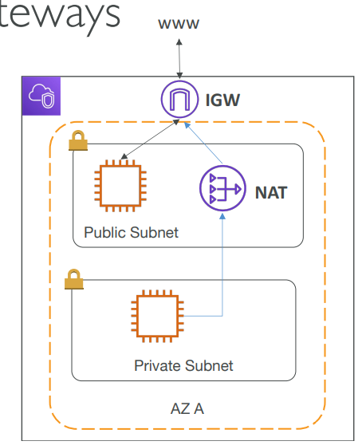
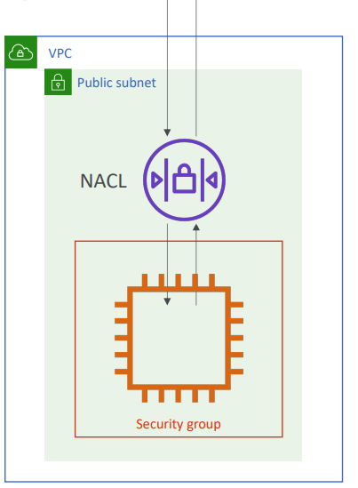
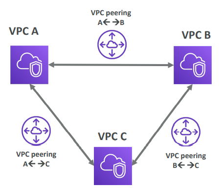
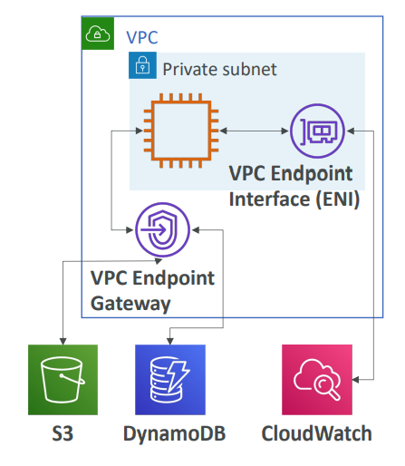
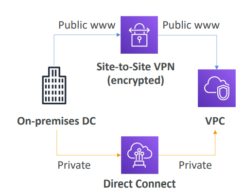

# VPC Basics 
- [VPC Basics](#vpc-basics)
  - [Disclaimer](#disclaimer)
  - [VPC \& Subnets Primer](#vpc--subnets-primer)
  - [Internet Gateway \& NAT Gateways](#internet-gateway--nat-gateways)
  - [Network ACL \& Security Groups](#network-acl--security-groups)
  - [VPC Flow Logs](#vpc-flow-logs)
  - [VPC Peering](#vpc-peering)
  - [**VPC Endpoints**](#vpc-endpoints)
  - [Site to Site VPN \& Direct Connect](#site-to-site-vpn--direct-connect)

## Disclaimer
- VPC is something you should know in depth for the AWS Certified Solutions 
Architect Associate & AWS Certified SysOps Administrator
- less than1 or 2 questions at your exam
  
## VPC & Subnets Primer 

- VPC: private network to deploy your 
resources (regional resource)
- Subnets allow you to partition your 
network inside your VPC 
(Availability Zone resource)
- A **public subnet** is a subnet that is 
accessible from the internet
- A **private subnet** is a subnet that is not 
accessible from the internet
- To define access to the internet and 
between subnets, we use Route Tables

- By default one vpc for one region created by aws

## Internet Gateway & NAT Gateways

- Internet Gateways helps our VPC 
instances connect with the internet
- Public Subnets have a route to the 
internet gateway.
- NAT Gateways (AWS-managed) & 
NAT Instances (self-managed) allow 
your instances in your Private Subnets 
to access the internet while remaining 
private

## Network ACL & Security Groups

- NACL (Network ACL)
    - A firewall which controls traffic from and to 
    subnet
    - Can have ALLOW and DENY rules
    - Are attached at the Subnet level
    - Rules only include IP addresses
- Security Groups
    - A firewall that controls traffic to and from an 
    ENI / an EC2 Instance
    - Can have only ALLOW rules
    - Rules include IP addresses and other security 
    groups

## VPC Flow Logs
- Capture information about IP traffic going into your interfaces:
  - VPC Flow Logs
  - Subnet Flow Logs
  - Elastic Network Interface Flow Logs
- Helps to monitor & troubleshoot connectivity issues. Example: 
  - Subnets to internet
  - Subnets to subnets
  - Internet to subnets
- Captures network information from AWS managed interfaces too: Elastic 
Load Balancers, ElastiCache, RDS, Aurora, etc… 
- VPC Flow logs data can go to S3 / CloudWatch Logs

## VPC Peering

- Connect two VPC, privately using 
AWS’ network
- Make them behave as if they were 
in the same network
- Must not have overlapping CIDR (IP 
address range)
- VPC Peering connection is not 
transitive (must be established for 
each VPC that need to 
communicate with one another

## **VPC Endpoints**

- Endpoints allow you to connect to AWS 
Services using a private network instead of 
the public www network
- This gives you enhanced security and lower 
latency to access AWS services
- VPC Endpoint Gateway: S3 & DynamoDB
- VPC Endpoint Interface: the rest
- Only used within your VPC

## Site to Site VPN & Direct Connect

- Site to Site VPN
  - Connect an on-premises VPN to AWS
  - The connection is automatically encrypted
  - Goes over the public internet
- Direct Connect (DX)
  - Establish a physical connection between on- premises and AWS
  - The connection is private, secure and fast
  - Goes over a private network
  - Takes at least a month to establish
- Note: `Site-to-site VPN and Direct 
Connect cannot access VPC endpoints`
